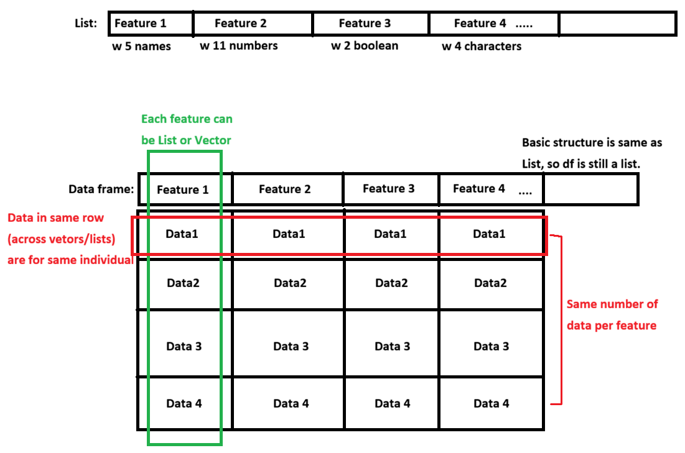

# Data Frame

So far we reviewed many types of object, from vector to list. Now, how do we find a 'pattern' of collection of data? It can be regression, clustering, or any other methods, but there's something that never changes: All valid data points have result (Output) corresponding to the observation (Input). In other words, you must have pairs of x and y values. Think about it, can you draw best fit line between patient's age and blood pressure, can you draw a line only using age?

However, data structures we saw so far have limitation with giving us (X,Y) pairs:

-   Matrix: While matrix gives nice 2d, row-column structure, it could not handle multiple data types.

-   List: This was solution to limitation of matrix. While it holds mix of data at once, it lacks strict structure. As result, it is difficult to guarantee that your list component of "Ages" and "Diagnoses" have same number of entries to form clean, row-by-row data pairs.

So what's the solution? How do we keep perfect two dimensional (m x n) data structure that stores mixed data type? We use "data frame" (or df), and this is absolute standard of structure in data analysis. It builds top of the list (so techincally df is still a list) and adds solid 2d structure. Not sure about how that looks like? here's the figure:



## Categorial Variables and Factors

### Factors and Levels

Before we get into exploring components in df, we first need to understand how data are stored into each cells. Let's say we have people are voting on the survey: What is your blood type? 1)A 2)B 3)O 4)AB

Here, what we care about bloodtype (A/B/O/AB). Let's create a list with responses.

```{r}
results <- c(1,3,2,4,3,4, 5)

mean(results)
```

In the survey, 1\~4 meant to represent corresponding to the blood type. However, calculating average returned 3.14. What does mean, people have 3.14 blood type in general? It doesn't make sense! Also, there was no option '5' but R didn't tell us that something is wrong. Why is this happening? It's because contents in the list thought they were numerical values.

factor() is a data class (if you forgot what class, object, and attributes were, review earlier chapter!) that contains overall question. Level is a attribute that contains rules/options within the factor. Let's check what that means by creating a factor.

```{r}
factoredresult <- factor(results, levels = 1:4) 
# Create a data structure with values of 'results' and options of 'levels'

factoredresult
mean(factoredresult) #Will this return 3.14 again?
```

Now, look at the output. Do you see levels (options) we assigned? Since available levels are 1\~4, 5 in the list returns NA. Also, because list is a factor with levels instead of a numbers, mean(factoredresult) is NA. It correctly reflects the fact that we can't average survey options!

But looking at numbered levels might be confusing. If we have list of 132423124123213... with thousands of entires, manually reviewing the list will be nightmare. To resolve readability, we can use levels() to assign level with custom names.

```{r}
factoredresult

levels(factoredresult) <- c("A", "B", "O", "AB")
#levels in the list was 1, 2, 3, 4. Now, we're giving them a name for each!

factoredresult
```

Clean!

### Ordered Levels

Sometimes, you might have a ordered levels. For example, a data set where levels are "very bad", "bad" "normal", "good", "very good"

While you can declare factors() for this, there is one headache when getting a statistics: you can't filter out people with more than certain satisfaction level. For example, you won't be able to view individuals with normal or higher satisfactions, because R takes level names as text and that they don't know their rankings/orders. Let's try it

```{r}
satisfaction <- c("verybad", "verybad", "verygood", "good", "normal", "bad", "good")

factoredsat <- factor(satisfaction, levels = c("verybad", "bad", "normal", "good", "verygood"))
factoredsat

factoredsat > "bad"
```

As you can see, it returns NA because R doesn't know relative orders of the levels. To resolve this issue, we use argument called ordered.

```{r}
orderedsat <- factor(satisfaction, ordered = TRUE, levels = c("verybad", "bad", "normal", "good", "verygood"))
orderedsat

orderedsat > "bad"
```

Unlike how last cell just printed out all levels, this time level are ordered by \<. But remember, ordered rank levels from smallest to largest in input order. If you put levels = c("good", "bad"), it will remember as bad \> good.

And now, we can filter data with threshold because levels are ordered. Do you see how it says True or False based on data in the factor (in the cell below)?

```{r}
orderedsat
orderedsat > "bad" #Checking which data has satisfaction with normal or higher
```

### Editing Level orders

While assigning factor() and levels are good, table and graph will print levels in input order. For example, if we say levels = c(2,4,3,1), then table will have column ordered in 2,4,3,1.

```{r}
factoredresult

table(factoredresult)
```

Then, what if we want to display something on the first column? we use relevel(). ref argument make assigned level to be displayed first while keeping the rest same order.

```{r}
factoredresult2 <-relevel(factoredresult, ref = "O")

factoredresult2
table(factoredresult2)
```

Now, do you see how levels are listed in O A B AB, instead of A B O AB?

## Creating a data frame

We know what df is, and that column is feature while rows are individuals. Then, let's make one!

Remember: df has m x n structure. This means that all column (features) must have same number or rows (observations). When we create a df, data on the same row will become a dataset for that individual.

To declare df, we use command data.frame(factor1, factor2, factor3,...)

```{r}
name <- c("Alex", "Banana", "Clown", "Donkey", "Elex")
gender <- c("M", "F", "M", "M", "F")
height <- c(1, 2, 4, 3, 4)

tests <- data.frame(name, gender, height)
tests
```

As we discussed, df has characteristic of both list and matrix. This means that we can add more data or generate df through cbind() or rbind()! Or, since df is still a list, we can add columns just like how we did it in previous chapter.

```{r}
bt <- factor(c("A", "O", "B", "O", "AB"))
cbind(tests, bloodtype = bt) # Again, remember that length should be same as other columns. 
rbind(tests, c(name = "Frona", gender = "F", height = "6", bloodtype = "A"))

tests$COVID19 <- c(T, F, F, T, T)
tests
```

Q1. Why do you see warning in rbind()? Why aren't we seeing bloodtype column after adding new row to tests using rbind()? Send me an answer to email! (Hint: declaring variable)

There is ONE VERY IMPORTANT concept you need to remember when adding data into data frame (also matrix). They are UNPACKED. What does it mean by that?

```{r}
test_id <- c(1, 2)
bp_matrix <- matrix(c(97, 76, 102, 134), nrow = 2, ncol = 2)
test_df <- data.frame(ID = test_id, bp = bp_matrix)

test_df
```

Do you see how 2x2 matrix is added to df? Earlier we said column in df are each features. So when we add matrix into df, it feels like entire matrix should become a single column in df (since whole matrix is a feature we're trying to add). However, this didn't happen. When data are combined into single df (or matrix), R discect each data into all individual columns. So we don't have one matrix in one column of df, but 2 vectors (from matrix) across 2 columns of data frame.

Remember, data frame and matrices are unpacked.

## Indexing Data Frame

Recall that data frame is still a list. So, indexing goes same way as list does.

```{r}
tests

tests[["height"]]
tests$name
tests[[1]] ## $name and [[1]] are same thing because 1st column is name
tests$name[1:3]
```

One detail to remember here is the difference between indexing using \[\[\]\] and \[\]. tests\[\] recalls the column of data (tests df) we're looking at. This means that \[1\] extracts first column of 'data frame,' which is a portion of 'data frame.' So, \[\] returns data frame. However, \[\[\]\] recalls 'content only' of data. This means that \[\[1\]\] extracts feature (list/vector) stored in first column of data frame, which returns list/vector but not data frame. Do you see how one is still list (data frame) while another becomes vector (char)?

```{r}
a <- tests[1]
attributes(a)
typeof(a)
```

```{r}
b <- tests[[1]]
attributes(b)
typeof(b)
```

Also, list had similar structure to matrix, where number of rows of all features are identical. Because of this characteristic, you can index or perform operations on data frame just like how we treat matrix.

```{r}
tests[1:2, ]
tests[-3]
tests[1:2, c(1,4)]
tests$height > 2
tests[tests$height != 2, c("name", "height")]
```

Also, we can sort dataframe like how we did in matrix.

```{r}
tests[order(tests$height, decreasing = T), ]
tests[order(tests$height, tests$COVID19), ] #What do you think order(A, B) does? 
```

Last, if you been running codes with me, you probably felt you're getting tired with repeating object name over and over, like tests\[order(tests$height, tests$COVID19), \]. You had to state df tests 3 times to filter the data. Now, we have alternative option, subset().

subset() allows you to omit the object name, and use feature name directly.

```{r}
subset(tests, height > 2)
subset(tests, height > 2, c(1:2))
```

## Functions in data frame

Nothing new. Since it has characteristic of both list and matrix, all functions you use in list and matrix can be applied to data frames too. Review them!

## Reading, Editing, Saving Data Frame

Since we know how to work with data frame, let's talk about now we load the table or data frame, edit them, and rewrite them from your computer.

### Working with Text Files

First, let's create example text file format df. Open your notepad, and copy paste following. Save the file as "Test_txt" in the directory your project is in.

```         
Name Scores
A 25
B 31
C 92
```

If you're not sure if the file is in your directory, you can check your working directory using getwd(). You can also use list.files() to see files exist in your directory and check if you saved file in correct location.

```{r}
getwd() #get working directory
list.files() #list files exist in working directory
list.files(pattern = "txt") #list files with contains "txt" in the name only
```

When you load your file, the file should be in your working directory. If not, you must put full location where file exists. You will use following format to load the text file: read.table(name or location, header)

```{r}
testfile <- read.table("Test_txt.txt", header = T) #If file is in the working directory
testfile

textfile2 <- read.table("C:/Users/louis/Downloads/IHC/EHR/Pics/R Guide/Test_txt.txt", header = TRUE) #If file is somewhere else
textfile2
```

Here, let's look at what header does. When we write a table, we always state what row and columns are, right? In programming languages, those 'title' for columns and rows are called headers. That said, let's compare two

```{r}
testfile 

testfile2 <- read.table("Test_txt.txt", header = F)
testfile2
```

Do you see how Name and Score are counted as column names when header is true, but counted as data when header is false? Instead, header = F assigned random names to fill out the missing column names.

Now, open our txt file and add row names. So it would look like following.

```         
Name Scores
1 A 25
2 B 31
3 C 92
```

Now, run the code in previous cell again with header = T. Then, run another with header = F. Now you'll run into error and data table doesn't load. Why is that? (Hint: Where does row names fits if row names are not headers?) So it's always important to check if data has headers!

Typically in data analysis, you want to remove row names from raw data. It's because R (or other program languages) automatically assignes row names as it loads the data. So if we manually assign index for each row, you might run into headers issue (like you just saw). Or, because R automatically assign index/rowname, R will think manually assigned index must be actual data and ruin your data set even before any analysis.

### Working with CSV data

Well we reviewed how to load the data tables, but most of data are normally in excel files. Especially, a csv file (comma-seperated values), meaning each cells are seperated using comma.

In the same way, let's create sample csv file first. Open your excel, write same content as data table above, and save it as csv file in your working directory. Now, again, you should see it in your "files" tab, bottom right of R Studio, if it saved correctly. Let's try to load this csv. We use read.csv() for that.

```{r}
testcsv <- read.csv(file = "Test_excel.csv")
testcsv 
```

While you can also use header = T, you must tell sep = ',' This is because of difference between text file and csv file. In text file, space are used as indicator that tells R "we use space to differentiate each cells." Similarly, CSV comma to separate cells. So, we just state that comma is used to separate cells, not space. To check this point, let's do quick practice:

Load csv without sep = ',' argument. Then, try to calculate average of score column. Can you get the answer or do you get NA?

Another point is row name (or index of data). When you load the testcsv, indices (1,2,3) have randomly assigned column name X. Why? (Hint: We just talked about this). If you figured out why, let's remove them.

```{r}
edited_csv <- testcsv[, -1]
edited_csv
```

Since we made change, let's save it into csv file. We'll use write.csv(data you're saving, file = "file name").

```{r}
write.csv(edited_csv, file = "Revised_CSV")
```

Once you run that code, you'll see a csv file generated in your working directory. But wait, if you open the file, do you see how row name is saved? This will create issue we discussed earlier if we try to load that csv next time. To prevent this, we use argument 'row.names = F' (don't save row names in generated CSV file).

```{r}
write.csv(edited_csv, file = "Revised_CSV2", row.names = F)
```

If you open CSV2, we don't have row names saved and R will re assign it when we load CSV file again!

We use same method for writing table.

```         
write.table(saving data, file name, row.name = F)
```

### Saving Multiple Objects

We reviewed how to save csv. But what if we have 100 data structures to save? Repeating write.csv 100 times will be both tiring and time consuming. For this situations, we have functions that exports/imports all objects created in current environment (variables/objects saved from codes you run so far). Let's say you made vector X, list Y, and data frame Z. Then, we can export them into single file using follow command.

```         
#I didn't do it here, but make objects and try it yourself!
Let's pretend you made X, Y, Z.

save(X,Y,Z, file = "File name")

Then, you'll see that file called (File name.RData) is created. You can load it using following command instead of using read.csv() 100 times!
load("File name.RData") 
```

## Summary

Now, we learned how to create data frame, a structured data format that has perfectly matching dimension. Each features have same number of variables saved, allowing us to perform data analysis while being able to track which row was who. Next Chapter, we'll explore how we use package called 'dplyr' to edit data frames more conveniently. See you soon!
