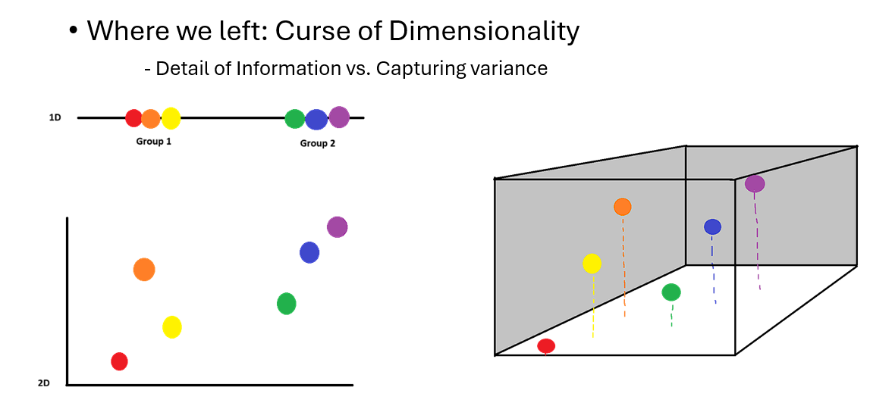
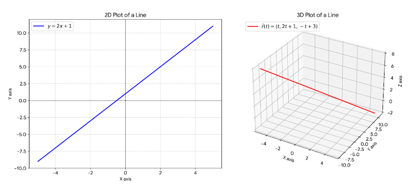
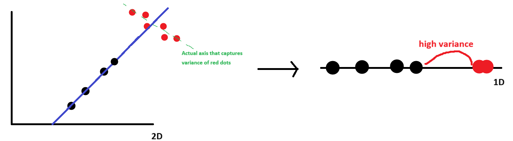
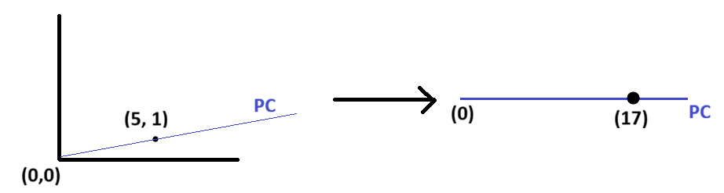

# Dimension Reduction

## Why do we need it?

In the meeting, we talked about curse of dimensional.



Let's load example data frame to recap what it was. Download it using this link: [Link](https://drive.google.com/file/d/12IpvIf4NwaSfv1NH-JVVTJRlUKbnB5zK/view?usp=drive_link)

Just like we did last chapter, let's load tidyverse and read csv.

```{r}
library(tidyverse)

vitals <- read.csv("Vitals.csv")
head(vitals)

vitals <- vitals[, -1] #What does this do? Why do we do this? If you forgot, revisit chapter 6.
head(vitals)
```

Here, you see lots of features. Two things:

-   MAP (Mean Arterial Pressure): (SBP + 2 \* DBP) / 3. Indicates organ perfusion.

-   Shock index: HR / SBP. Assess hemodynamic stability.

These variables, which are calculated from existing variables, are called derived variables. In data analysis, we often use derived variables as they can be meaningful while reducing number of variables. For example, height or weight itself cannot tell whether individual is obese. You might think, "isn't patient obese if they are 200kg?" What if he is 2m tall and that his weight is within normal range for his height? However, if we combine height and weight into BMI, that can indicate whether someone is obese or not.

But then, is having multiple variables good thing since they have significance? Let's figure it out. First, let's check correlation among variables. For sake of readability, let's only use last 5 variables.

```{r}
library(corrplot) #This package helpes us calculating and plotting correlations

cor(vitals[, 7:12]) %>% #calculate corrlation (cor) and pass the result to (%>%)
  corrplot(order = "hclust") #plot the correlation
```

Correlation score closer to 1 (darker blue, bigger circle) means two variables are positively and linearly related, and score closer to -1 means they are negatively and linearly related.

If we try to score patient's health using those 5 variables, what would happen? Even thought all blood pressure , oxygen saturation, and respiratory rate are important, score will be dictated by blood pressure because more than half of variables are from identical source.

That said, what were some consequence of high dimensional data? There are three major downsides:

1.  Waste of resource: Because there are more data to process and calculate, model suffers from longer calculation time. As result, more human and time efforts are wasted for meangingless data

2.  Overlapping variables: Like example we saw above, the more variables there are, the higher probability of having multiple features with high-correlation or even sharing identical source. As result, you artifically hide actually meaningful features reflected in the analysis.

3.  Overfitting: As you include more features, there is probability that you might include features that are irrelevant to the analysis topic. For example, let's say your analyzing gene of cancer patient. There are limited numbers of genes that cause cancer. However, if you analyze against entire human gene, something weird can happen. Because everyone contains gene that suppress cancer, your analysis will conclude that 'cancer suppress gene is causing cancer,' even though supressor genes are out of list of 'cancer-causing genes.'

That said, condensing data set with really meaningful and non-repetitive features becomes important. And that's, why we need dimension reduction.

## PCA (Principal Components Analysis)

### Concept of PCA

During the meeting, we said PCA is like finding a perfect shadow (line that captures most variance). Since we reviewed visualized approach, let's talk little bit about the concept in mathematical aspect. First, let's look at what those 'lines' actually means, and how we maximize variance of data points.

For each features, there will be one axis that explains the feature. Think like axis on the plot.

1 feature: line/one axis (e.g., you can plot severity of pain on a line with scale of 0 to 10)\
2 features: plane, which has two axis (e.g., you can plot relationship between SBP and DBP on 2d plot)\
3 features: 3d cube, which has three axis\
and more...

Then, all lines on a space will be combination of each axis, like figure below.



\* If you haven't learn vector equation, r(t) is something like this:

As demension increases, you cannot draw a line using "y = \~" form. For example, draw z = 2x + y on the [desmos](https://www.desmos.com/calculator?lang=en). It's a plane! So to draw a line, we need to define exact (x,y,z,...) coordinate for all points existing on the line. For example, in y = 2x + 1, we can say all possible combination of (x,y) on that line is (t, 2t + 1), where t is random number. So, instead of y(x) = 2x + 1, we can express it using r(t) = \<t, 2t + 1\>.

When we draw a line using combination of existing axis, we call that 'linear combination.' For example, line ax + by + cz.

Now, let's look at equation of principal component with q number of features.

$$ Z_k = a_{1k}(X_1 - \bar{X}_1) + a_{2k}(X_2 - \bar{X}_2) + \dots + a_{pk}(X_p - \bar{X}_p) $$

-   Zk is a principal component (PC) made from linear combination of features, where k = 1, 2, 3,... q. Why k can't be larger than q? It's because we only have q features we can use to combine! You can't come up with combination using 3 features in 2d plot.

-   ajk is a loading/weight of each feature. For example, in y = ax, y will be horizontal line if a = 0, diagonal is a = 1, and vertical if a becomes infinitely large. So ajk means "How well kth PC aligns with jth feature?" If a1k = 1.0, it means first PC perfectly aligns with first feature/axis, and if a1k = 0.0, it means first PC doesn't align with first feature at all.

-   Last part, X1 is feature 1, and $\bar{X}_1$ is average of feature 1 (e.g., in the corr plot we saw above, it would be all average values of MAP values). You might got confused: we just said linear combination is 'a(feature1) + b(feature2)...' But why suddenly $(X_1 - \bar{X}_1)$ instead of feature itself (X1)?\
    \
    PC is a axis/line that captures most 'variance.' Then, how do we calculate the spread of points within the feature? We can't compare distance of all point pairs in the feature. Instead, we look for individual point's distance from their average. So, we pick a line that goes through the mean of feature1, and find a slope to tune the spread - we have PC that works for feature 1. But, there are multiple features in the data set (that's why we're performing PCA, right?)! This means that not only feature 1, but also rest of the feature's variance should be maximized through PC.\
    \
    However, here is the trap: is variance of feature 2/3/... shown when they are plotted onto PC actually reflects the spread of the data points (distance from feature 2/3/...'s mean) or is it because of distance from points to PC (distance from PC)? Figure below visualize this issue:

    

    Here, PC (blue line) captures variance of patient group 1 (black dots) reasonably well. However, it completely fails to capture the variance of the patient group 2 (red dots). However, PCA can't tell that. On the 1D plot, do you see there's a massive distance between two patient groups? Because mean of two groups are so far away, it looks like PC is capturing variance of all points well based on "high variance" region (fake variance) even though it fails separating group 2.

    \
    So, to reflect variance of all points accurately, we need to standardize the location of means across all features. How? by $(X_1 - \bar{X}_1)$! If average height is 1.67m, we can move every point by 1.67m to the left so that average seats on the origin. Now, we have a stable and accurate way to check PC's ability to capture variance, as PC goes through (0,0) where center/average of all data points are!

Now, we know how PC line Zk is created. Then what? If we select random weights for the equation, we can calculate new coordinate of a point along the Zk.

For example, in "Zk= 2x + 3y," 2 and 3 are weight, where as x and y are features. If raw 2D plot using x and y as axis have a first point (5, 1), Z1 = 17.

{width="490"}

If we calculate Zk coordinate for all data points, we can calculate variance of points on the PC, which is (sum of square of Zk values) / (N - 1). Algorithm test all possible combinations of weight until it finds the highest variance value. Now, we know how PCA reduce dimension!

### Running PCA

Executing PCA is done by function called prcomp() in stat package. You need to select

```         
prcomp(analyzing data)
```

```{r}
result <- prcomp(vitals[, c("Systolic_BP", "Diastolic_BP")]) # Running PCA using last 2 vital signs

result
```

In the result, you see two tabs. Standard deviation is squared root of (sum of variance squared), where it shows how well each data points are separated when you plot all data into each PC. For example, if you plot all points on PC1, standard deviation is 2.14, while using PC2 gives std of 0.106.

Rotation is where it shows loading of each features. Here, we see that PC1 seperates SBP well, while PC2 separates DBP well.

But our interest is "How much variance does each PC capture," not if points are sepereated. prcomp() is consist of multiple lists. Let's look at some other components in prcomp().

```{r}
summary(result)
```

Proportion of variance is how much each PC explain the variance. As you can see, in PCx, number x is labeled in a order of explained variance (PC that captures the most becomes first PC). Cumulative proportion is total variance explained using All PCs starting from PC1 to xth. Since we started with 2 axis, PC2 will give us 100% explained variance.

Besides rotation/std/explained variance/cumulative variance, we have one more data in prcomp(), which is center. Center is just avereage value of each features.

```{r}
result$center
```

Let's revisit the equation we talked about earlier and see if result aligns with our explanation (PC1 capturing variance well).

$$ Z_k = a_{1k}(X_1 - \bar{X}_1) + a_{2k}(X_2 - \bar{X}_2) + \dots + a_{pk}(X_p - \bar{X}_p) $$

Then, our PC1 will be

$$ Z_1 = (Loading\ of\ SBP)(SBP - Avg\ SBP) + (Loading\ of\ DBP)(DBP - Avg\ DBP)$$

Let's vizualize PC1 with our data.

Note1: I'm saving each loading into separate variable for readability of the code, but you can just use result\$rotation and center directly

Note2: Let's talk about why slope and intercept equation looks like that.

Slope - loading was 'how much of feature is used in PC.' If 100% of feature 1 is used, loading of feature 1 would be 1.0. But what does that really mean? If point move 1 unit along feature PC, it will also move 1 unit on feature 1 axis. If loading of feature 1 was 0.4, point would move 0.4 unit along feature 1 axis everytime it moves 1 unit on the PC.

Slope is (change of y) / (change of x). If x axis is feature 1 and y axis is feature 2, what would happen when point moves by 1 unit along PC? point will move (loading of feature 1) on y direction, and (loading of feature 2) on x direction. Now we have slope! (Loading1) / (Loading 2).

Intercept - b = y - ax. Since we know slope, we need x and y values that's on the PC. How would you find (x,y) along PC when all data points are scattered around and we don't know equation of PC? Recall how PC is calculated: PC goes through the average of all features because of mean-centering (moving averages to (0,0))! That said, we can use center values stored in the result.

```{r}
Load_SBP <- result$rotation[1,1] 
Load_DBP <- result$rotation[2,1]
Avg_SBP <- result$center[1]
Avg_DBP <- result$center[2]


p <- ggplot(vitals, aes(Systolic_BP, Diastolic_BP)) +
  geom_point() + #plotting data points
  geom_abline(slope = Load_DBP / Load_SBP, 
          intercept = Avg_DBP - Avg_SBP * (Load_DBP / Load_SBP), color ="blue") + #plotting PC1 line.
  geom_point(x = result$center[1], y = result$center[2], color="green", size=10, shape=2) #plotting center
```

Does shape of PC1 make sense? if you try to spin it around the center, can you find a line where points are spread throughout PC further? No.

Similarly, let's add PC2.

```{r}
# 1. Grab the loading for Principal Component 2 (Column 2)
Load2_SBP <- result$rotation[1,2] 
Load2_DBP <- result$rotation[2,2]

# 2. Add the PC2 line to existing plot 'p'
p + 
  geom_abline(slope = Load2_DBP / Load2_SBP, 
              intercept = Avg_DBP - Avg_SBP * (Load2_DBP / Load2_SBP), 
              color = "red", 
              linetype = "dashed") + 
  coord_fixed(ratio = 1) #This makes visualized x and y range identical
```

Look at relationship between PC1 and PC2. Do you notice anything? PC1 and PC2 are orthogonal (perpendicular)! Let's revisit the result

```{r}
summary(result)
```

It says PC1 explains about 74% of variance. Then, where are 26% of missing spread? Look at our visualized PCs in the figure above. If you compress all points onto PC1 (blue line), think about what happens to points that are stacked in (perpendicular to PC1) direction: They will be on the exact same spot on the PC1. This means that if we use only PC1, we cannot explain any variance that are spread perpendicular to PC1!

Losing information (variance) in this manner also means that if we introduce PC2, which will explain information missed in PC1, it will be perpendicular direction!

As result, every time we add new PC, it will be orthogonal to all other PCs.

Now, let's perform PCA using all values in the data frame.

```{r}
vital_pcr <- vitals %>% 
  select(-Patient_ID, -Diabetes_Status) %>% #We perform PCA on numbers, not letters or ID (not clinic data)
  prcomp()

summary(vital_pcr)
```

### Scree Plot

Now, we have 10 PCs because we have 10 features! When we perform further data analysis, should we use all 10PCs? No, the purpose of PCA was to reduce dimension to resolve 3 issues we discussed earlier. Then how many PCs should we use? Threshold percent of cumulative explained variance, we talked about it during the meeting.

Here, let's talk about another method of determining how many PCs we should use: Elbow method through scree plot. Scree plot is a figure where you plot proportion of variance per PC (x axis - PCs, y axis - explained variance). To draw a plot, we use screeplot().

```{r}
screeplot(vital_pcr, type = "lines", main = "Scree Plot") #If you leave type empty, default is bar graph
```

Or, we can save percent variances manually and use ggplot().

```{r}
#1. Square std to find variance, turning it into percent variance
var_prop <- vital_pcr$sdev^2 / sum(vital_pcr$sdev^2)

#2. Create var_prop data frame for ggplot()
scree_data <- data.frame(PC = 1:length(var_prop), Explained_Variance = var_prop)

ggplot(scree_data, aes(PC, Explained_Variance)) +
  geom_point(color = "blue") +
  geom_line(color = "black") + 
  scale_x_continuous(breaks = length(scree_data$PC)) + 
  labs(x = "Principal Component", y = "Proportion of Variance Explained") +
  theme_minimal()
```

While we want to reduce the dimension, we don't want to lose too much data. So, we want to keep the number of PCs where "adding another PC does not add any meaningful information" There are many ways to choose this number, but we'll review only few common methods, from simplist (crude analysis) to complex (rigorous analysis):

1.  Using cumulative explained varariance (typically over 70\~90% depends on the purpose). Limitation: This barely differentiate what's the boundary of PC that captures meaningful and negligible variance.

2.  Elbow method, where you see variance of PC decrease most significantly or starts to flat out. Since elbow is where information start to become meaningless, we use number of PCs before the eblow. Limitation: standard of "elbow" and "flatness" is subjective, potentially hurting credibility of analysis.

3.  Using Kaiser Criterion (rule of 1), where only PCs with raw variance higher than 1 are used. Limitation: The Kaiser Criterion is easily fooled by redundant data. The Rule of 1 assumes that every column in our dataset represents a unique, valuable piece of information. However, clinical data often contains redundant features (e.g., exporting "Manual Pulse," "Machine Heart Rate," and "ECG Heart Rate" for the same patient). Because these three columns perfectly correlate, PCA will group them together into a single Principal Component. That PC will capture a massive amount of variance higher than 1.0. The Kaiser Criterion will tell us this is the most "meaningful" trend in our clinic, but in reality, it is just the exact same vital sign repeated three times. It artificially inflates the variance without adding any real clinical value.

IMPORTANT: To use this method, you must standardize the data set, which we will discuss in later.

4.  Using Parallel Analysis, where computer creates data set with random numbers of same features and rows. Because values in the data set are 'random,' (as they're spread equally), there is no pattern or 'which PC are significant.' as result, it will show linear-like line on the scree plot. We compare our scree plot and random-value based scree plot, we conclude which PCs contains lesser information than 'random.'

To perform parallel analysis, we use package called psych. Install it in your console.

```{}
install.packages("psych", repos = "http://cran.rstudio.com/")
```

Then, you can generate scree plot from performing PCA of randomly-generated values that has same number of features/entries with our vital data frame.

```{}       
fa.parallel() is the function we use.

fa.parallel(our actual data frame, mode, number of random entries we need, main (if you want title for result plot))
```

Before we run the code, don't forget to load the package!

```{} 
library(psych)

#fa = "PC" tells code that we're doing parallel analysis for PCA
#we need to feed raw data set that we run pcr, not the pcr result. Don't but vital_pcr!

vital_data <- vitals %>% 
  select(-Patient_ID, -Diabetes_Status)

pa_result <- fa.parallel(vital_data, fa = "PC", main = "Parallel Analysis")
```

If you ran the code, you probably got following error:

```         
Warning in fac(r = r, nfactors = nfactors, n.obs = n.obs, rotate = rotate,  :
  An ultra-Heywood case was detected.  Examine the results carefully
```

Heywood case means two or more features have 100% or higher multicollinearity. This make sense! If you revisit features, we have derived features like MAP, which are basically same thing as regular SBP/DBP since the source of features are identical. So, code is telling us "your data set is not processed well enough for PCA!"

So, let's remove those overlapping features and try again.

```{r}
clean_vitals <- vitals[, c("Age", "Temp_C", "Heart_Rate", "Systolic_BP", "Diastolic_BP", "Resp_Rate", "SpO2")]
pa_result <- fa.parallel(clean_vitals, fa = "pc", main = "Parallel Analysis of Raw Vitals")
```

-   PC Actual data: scree plot of PCA using original data set

-   PC Simulated data: scree plot of PCA using randomly generated values PC

-   PC Resampled data: scree plot of PCA using values from original data set but randomly mixed

Both PC simulated/resampled data establish baseline noise (zero statistical significance) level. Any PC that has meaningful separation of data points will have higher explained variance than variance explained by baseline noise. In the plot above, code concluded that PC1 alone is good enough dimension reduction for further analysis (number of components =  1 ).

Limitation: Sometimes, these random baseline noise underestimate of real components when data set contains overwhelmingly dominant pattern. This imbalanced data cause smaller (but clinically important) signals to be discarded as noise. 

For example, if clinic overflows with fever patients, you will see high variance in a lot of vital signs, like body temperature.This huge variance makes small change in SpO2, which is still clinically significant, appears PCs with small variance captured. As result, important information looks like a random noise. 


5.  Resampling PCA

Resampling in here is different to resampled data you saw in #4. Resampled data is mixing data randomly (e.g., exchanging values in [row1, column1] with [row1, column3]). Resampling data means you're extracting subset/portion of data to perform analysis. For example, executing PCA with 60% raw data and remaining 40% on validating the precision/accuracy of the result. 

So we understand that resampling split data to run PCA. But, how do we test the result with reamining data? This process is called reconstruction. Think this like derivation and integral! (where all result ends with "+C")

1) When we reduce dimension we will get a PC score per PC axis. For example, original (1,2) -> PC +1.3 (like taking derivative of a function). This part will be done by using only portion of the  data.

2) We calculate PC scores using remaining data which weren't used for PC weight/loadings calculation. (Testing phase)

3) Then, we try to backtrack/guess what the original location of testing points using the PC data. For example, because (1,2) become PC score of 1.3, when we see one of the testing point's PC score is 1.3, we guess that that point was originally at (1,2)!

4) But because reduced dimension always lose some information, guessing original data will have error (like +C in integral). For example, we guess calculated PC score of 1.3 is originally located at (1,2). But, it was actually at (1,3) checking at origianl coordinate of testing set!

5) Based on how 'off' the guessed location is from original data, we can calculate magnitude of error. Now we repeat the step 1~4 using 0 (complete random guess) ~ feature of original data set (no dimension reduced), calculting error for each number of PCs used. The lower the error is, more accurate and stable the model is. 

Let's look at how it's performed using missMDA package, which helps us with resampling testings. 

```{r}
#1. Install package that helps us dividing data sets and running cross validation (resampling)
# install.packages("missMDA")
library(missMDA)


#2. Run the Cross-Validation Stress Test
# ncp.max = 6: Tells the computer to test models using anywhere from 0 to 6 components
# method.cv = "Kfold": Tells the computer to use the "hide 20% of the patients" method

cv_result <- estim_ncpPCA(clean_vitals, ncp.max = 6, method.cv = "Kfold")
cv_result$ncp
```

```{r}
# Create the correct X-axis numbers (starting at 0)
# length(cv_result$criterion) is 7, so this makes a sequence: 0 ~ 6
x_values <- 0:(length(cv_result$criterion) -  1)

# Draw the plot with the explicitly defined X and Y axes
plot(x = x_values, 
     y = cv_result$criterion, 
     type = "b",          
     pch = 19,            
     col = "blue",        
     lwd = 2,             
     xlab = "True Number of Principal Components", 
     ylab = "Prediction Error (MSEP)", 
     main = "Cross-Validation: Finding the Optimal Cutoff")
```

Now, you see that using 2PC is best dimension reduction that reflects nature of original data structure.  

Question to think: using 6 PCs, where no dimension reduction is used, error is high. You might think if there is no dimension reduction, there is no information loss, so that error should be low. Why error is high? Contact me if you cannot think of why!

### Loading Plot

We discussed what loading is. Then, can you guess what loading plot is? Yes, it's a plot that shows loadings of each feature. We do draw loading plot because looking and comparing 'which feature influence seperation on the xth PC' becomes difficult as number of features increase (the more numbers there are, the longer/difficult it becomes!)

There are few ways to do this. 

1. First is a long ggplot() way, by extracting and plotting like we did in chapter8 (try it yourself)

```{r}
#1. Let's seperate loading values. 

loading <- data.frame(vital_pcr$rotation[,1:6]) %>%
            rownames_to_column(var="variable")                 
loading
```

```{r}
#2. Let's plot them. Here, we only did up to PC3, but remember that we actually had 6 features. You need to repeat 6 ggplot() for full visualization.

# 1. Install and load patchwork (the best plot-stitching tool in R)
library(ggplot2)

# 2. Build three individual plots using your original wide columns
p1 <- ggplot(loading, aes(x = variable, y = PC1)) + 
  geom_col() + 
  coord_flip() + 
  ggtitle("PC1")

p2 <- ggplot(loading, aes(x = variable, y = PC2)) + 
  geom_col() + 
  coord_flip() + 
  ggtitle("PC2")

p3 <- ggplot(loading, aes(x = variable, y = PC3)) + 
  geom_col() + 
  coord_flip() + 
  ggtitle("PC3")

p1
p2
p3
```

But, repeating same code over and over takes time and tiring. This is because you need to pick one column per axis, which force you to write ggplot() per column. To resolve this issue, we can do something called 
```{}
pivot_longer()
```

This function tells ggplot to combine data across different column so that you can assign multiple column for one axis. Then, we could use facet_wrap() because each column becomes subtype you can seperate!

```{r}
loading %>% #Pass loading data pivot_loner()
  pivot_longer(cols = c(PC1, PC2, PC3), 
               names_to = "component", 
               values_to = "loading_score") %>% #Pass combined data to ggplot() without variable statement
  ggplot(aes(x = variable, y = loading_score)) +
  geom_col(fill = "steelblue") +
  coord_flip() +
  facet_wrap(~ component) +
  labs(title = "Principal Component Loadings",
       x = "Clinical Variable",
       y = "Loading Score") +
  theme_minimal()
```

#### loading on PCA plot

While checking loadings per PC helps us with understanding how each feature influence each PC, it is difficult to understand "So what's feature's influence on overall/full PCA plot" There are few ways to do it.

1. First way is ggplot(). There is a separate package called ggfortify, which allow us to build ggplot() for PCA result. We use autoplot() to visualize the result, and change what varaible we want to plot by using the arguments. Google for plotting different features!

```{r}
library(ggfortify) 

autoplot(vital_pcr, loadings = TRUE, loadings.label = TRUE, loadings.label.size = 4)

# loadings = true (plot loading on PCA plot)
# loadings.label = true (label which arrow is which feature)
```

Now, instead of reading multiple loading plots separately and say "higher age pushes points to the left side of PC1, and upper side of PC2," we can look at PCA plot and recognize how each features change point's location on PCA directly.  

## Conclusion

Today, we looked at how we reduce dimension through PCA. Remember,
1) Standarize data set to remove population skewness
2) Decide how many PCs do you need to use
3) Run PCA.

Next chapter, we will look at how to cluster them!