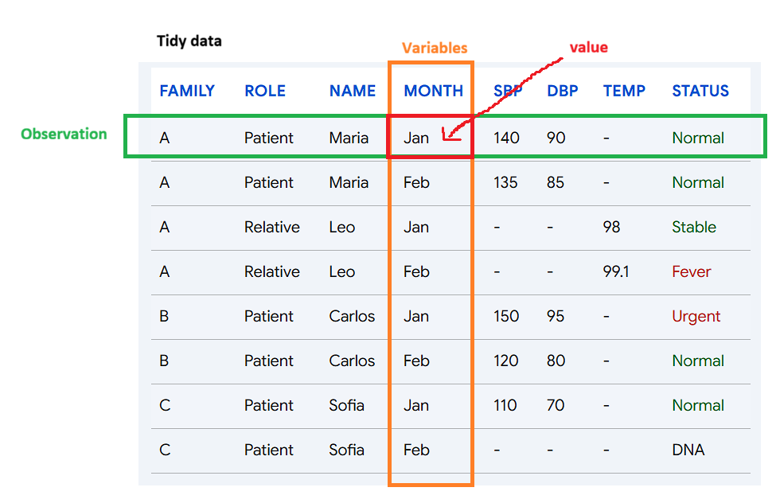
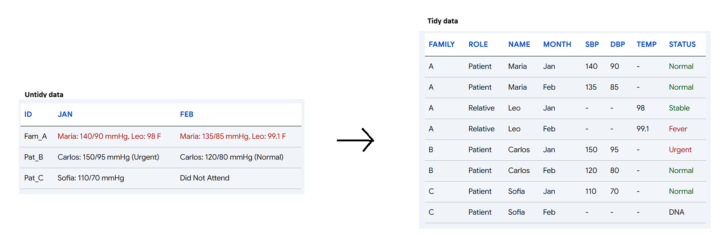
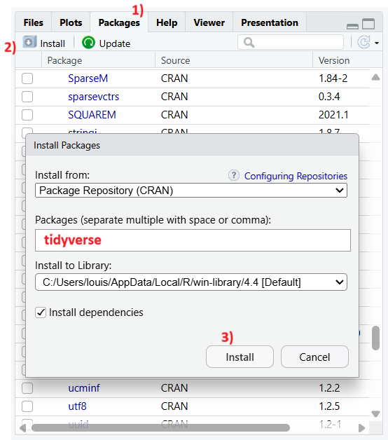
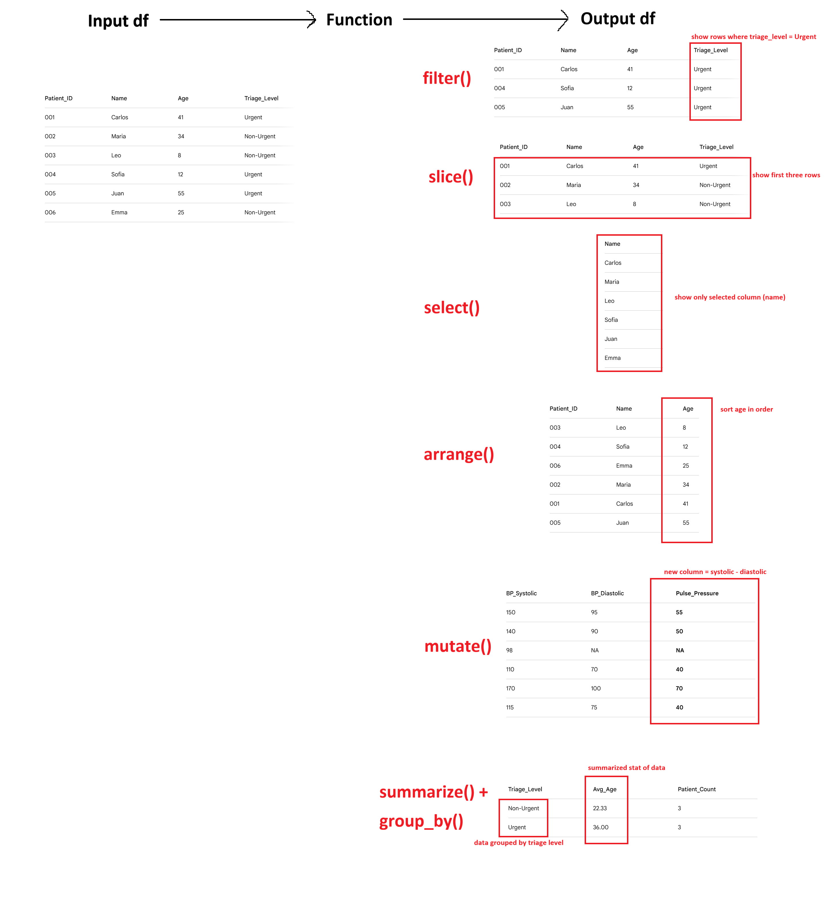

# 7 Editing Data Frame

In data analysis, you always must pre-process the data. This is to make sure that outliers won't influence quality of your analysis, and to check general statistics/summary of data for detailed analysis pipeline.

In the previous chapter, we learned how to create data frame. While we could perform calculations or editing df using operations we reviewed in Chapter 3-5, they often require repetitive typing or heavy manual step-by-step calculations. In this chapter, we'll learn package (like an extension) called dplyr which allows us to perform df edit in simple ways.

## tidy data (Organized Data)

Last chapter, we just said data analysis requires data with features of same size so that we can perform analysis like regression (and that df was the solution). However, there are few more details to care. Let's look into more details about how we want data to be organized.

](images/clipboard-430390019.png){width="571"}

1.  Each row of a data matrix has a one-to-one relationship with an observation.
2.  Every column is a single variable
3.  Every cell is a single measured value

Why are these essential in data science? Let's look at example df below:

```{r}
# The Ultimate Nightmare Dataframe
nightmare_df <- data.frame(
  Record_ID = c("Fam_A", "Pat_B", "Pat_C"),
  Jan_Triage_Data = c(
    "Maria: 140/90 mmHg, Leo: 98 F", 
    "Carlos: 150/95 mmHg (Urgent)", 
    "Sofia: 110/70 mmHg"
  ),
  Feb_Triage_Data = c(
    "Maria: 135/85 mmHg, Leo: 99.1 F", 
    "Carlos: 120/80 mmHg (Normal)", 
    "Did Not Attend"
  )
)

nightmare_df
```

-   Case1: Calculating patient volume Let's try to find how many patients we saw. Since we have patient names in each cell, can we find it by adding all cells (or counting how many cells we have)? There is actually no way to do this because first row contains two patients while second and third rows are single patients.

To calculate patient volume, each observation (row) must have only one patient (so that we can count number of rows and find how many patients we saw). As result, we come up with important condition, "Each row of a data matrix has a one-to-one relationship with an observation."

-   Case2: Tracking bp measurement over time This time, let's try to draw a line graph using bp in each months. In this case, our variable is month and observation will be measured bp. Now the question is, can you find a column or row that contains month? Answer is no because they're used as features (columns).

Variable is a concept we are measuring. Jan and Feb are specific data point (values) of a concept called 'Month.' By using months are colnames, we cannot extract 'month' variable needed for tracking bp measurement over time no matter what column or row we pick. Some might say "If we use row, then we can extract bp data per month." But each rows are 'observation': A set of values of individual accross multiple different features (variables), not all data in single varaible (If you're confused about this, feel free to email me).

So being unable to extract month data connects to rule number 2, "Every column is a single variable"

-   Case3: Extracting bp of single patient Now, let's try to extract bp measurement of single patient. Since each row contains triage data of visiting patients, can we say nightmare_df\$Jan_Triage_Data\[3\] will give us bp measurement? No. While row 3 is an observation specific to Sofia's triage data, single cell is containing all names, bp, urgency, etc. So even we extract that cell, how do R know which portion within that cell is what we asked for? Rather than looking the data as Name (character) + bp measurement (numeric), it'll be seen as one gigantic garbage block of text (character). This example leads to condition three, "Every cell is a single measured value"

Then, how would tidy data look like? Let's look at the figure below.



If we review 3 cases again, - Case1: We can calculate patient volume by counting columns - Case2: We can draw a line graph using Month column as x axis,and SBP/DBP columns as y axis - Case3: We can pick any cell in bp columns and will get clean bp measurement only

So untidy data might look for compact and organized, it's tidy data that actually allows us a statistical operations. One huge advantage of tidy data is that structure is formalized (one feature per column, one value per cell) that we can perform same operations throughout different column without customizing different calculation method every time. If we want to find average for each column, we can apply mean() to all numeric columns! That's something we can't do with untidy data.

# tidyverse package

Again, package is like an extension that allows you to perform commands in simple manner. tidyverse is a package that contains professional and organized methods to load, analyze, and visualize tidy data.

First, let's install tidyverse. In the Console, type "install.packages("tidyverse")". If it gives you error, then we can install it directly through Packages panel.

{width="291"}

Once you installed it, we need to load it. As we use R more, we'll install lots of packages. Loading all existing packages will be resources and time consuming, so as alternative, we state what packages we want to use for code we're running. Good news? We need to load them once per script, so we don't need to repeat it per cell. Let's load packages using library() command.

```{r}
library(tidyverse)
```

Take a look at 'Attaching core tidyverse packages.' "tidyverse" is package for handling all tidy data, which consist specific applications (packages within tidyverse). Since we're looking at how to manipulate tidy data, we'll only discuss about dplyr. As you go through this manual, we'll talk about other packages like ggplot2 (vizualization) too!

-   Side note: Since we loaded tidyverse, all packages within tidyverse are also loaded. This means that we don't need to run library(dplyr) again.

# What does dplyr do?

I've been mentioning that dplyr allows you to edit df, but how does it actually do it? There are 5 methods:

1.  Selecting Rows

-   filter(): Filter rows that meets condition
-   slice(): Extract selected rows
-   They differ as filter() looks for 'values' that meets condition, while slice() looks for 'rows' that you pick.

2.  Selecting Column

-   select(): Like slice(), it extracts selected columns.

3.  Arranging Rows

-   arrange(): Ordering rows using conditions you assign (e.g., decreasing order of column 1)

4.  Adding Columns

-   mutate(): Add new column using existing columns (e.g., New column = col1 + col2)

5.  Summarizing Data

-   summarize(): Squash selected dataset into single summarized row
-   group_by(): Group dataset into buckets of your choice
-   For example, summarize(age) will return average age of selected range. On the other hand, group_by(age) will set grouped filters of dataset, for example children and adult.

Let's look at the figures below in case explanations were not clear. Vizualization below shows how dplyr are like a function you learn in math courses.



Some might question, why do we need dplyr? For instance, summarize() does same thing that mean() function does. Can't we just use what R have? That is true, technically you can do everything that dplyr using basic R functions. However, there are some tricky situations. Remember how indexing df sometimes gives us df while other times it gives us list/vectors ( \[\] vs \[\[\]\] )? Basic R funcitions' input and output formats are different case by case, causing issues in analysis (because dimension might change and two different data might be incompetible for regression). However, dlpyr input and ouput structure of data stable and consistent.

# Loading Example Dataset

In R, and dlpyr, there are multiple example dataset available for us to practice coding and analysis. one of them is called 'mpg,' data collected by U.S EPA from 1998 to 2008 regarding vehicle type and their fuel efficiency. To practice dlpyr functions, let's first load mpg data.

```{r}
mpg
```

Each column consist following data: -manufacturer : maker of the car -model : name of the car -displ : engine displacement -year : year of the model -cyl : number of engine cylinder -trans : type of car transmission -drv : driving system. f = forward, r = rear, 4 = four wheel drive -cty : fuel efficiency in city -hwy : fuel efficiency in highway -fl : type of fuel -class : type of car (compact, suv, etc)

# Selecting Rows

## filter()

First, let's try out extracting rows that meets your column condition.

You use filter() by

```         
filter(dataframe, condition)
```

```{r}
filter(mpg, manufacturer == "dodge")
filter(mpg, year > 2001)
```

What if we have multiple conditions? We just add more conditions, like

```         
filter(datafram, condition 1, condition2, etc)
```

```{r}
filter(mpg, manufacturer == "dodge", year > 2001)
filter(mpg, year > 2001 | cty >= 30) #What does this mean? Review operator if you don't remember!
```

One thing to remember is that operator's priority does matter here. Again, anything in () calculates first, and & (and) executes before \| (or). So, (Condition1 \| Condition2) & Condition3 will filter in order of "data that meets condition3 among data that satisfies condition1 or condition2," while Condition1 \| Condition2 & Condition3 will filter in order of "data that satisfies (condition2 and condition3) or condition 1" They are different.

```{r}
filter(mpg, (model=="audi" | cty >= 20) & year == 2001)
filter(mpg, model=="audi" | cty >= 20 & year == 2001)
```

Check the result. Do you see how in the second sentence, all Audi cars are returned because our logic is "made by Audi" or "cty and year condition are met," while first sentence didn't return all Audi because the logic is (audi or cty \>= 20) "AND" model year is 2001?

## slice()

slice() was filtering rows of location you want. We use it by

```         
slice(dataframe, location1, location2, etc)
```

Again, one thing to keep in mind that positive number like 1 or 2 select 1st and 2nd row, while negative number like -1 select all but 1st row.

To easily understand slice(), let's first extract all Audi cars.

```{r}
audicars <- filter(mpg, manufacturer == "audi")
head(audicars)
```

Now, how would you extract 1\~3rd row and 5\~7th rows? What if you want everything but 1\~3rd rows and 5\~7th rows?

```{r}
slice(audicars, 1:3, 5:7)
slice(audicars, -(1:3), -(5:7))
```

### Useful variations

1.  slice_random()

    There are useful feature in slice(). When we talked about evaluating ML models, we needed some fresh/random testing set. But how can we select rows randomly? we have it!

```         
slice_random(dataframe, n = 5)      #This command extracts 5 rows randomly from dataframe!
slice_random(dataframe, prop = 0.6) #This command extracts 60% of rows randomly form dataframe!
```

2.  slice_head() (and tail())

    What if you want to extract first or last 5 rows? You can use slice(df, 1:5), but what if dataframe's size is unknown or so big? Instead of using slice(df, 99999999994:99999999999), we have head() and tail() like how we previewed data!

```         
slice_head(dataframe, n= 5) 
slice_tail(dataframe, prop = 0.4)
```

3.  slice_max() (and min())

    How about if you want to see a row with max/min value of specific value?

```         
slice_min(dataframe, column, n = 2, with_ties = F) #with_ties dictates whether to print all tying rows.
```

```{r}
#Do you see how we have top 3 rows with highest cty among Audi cars?
slice_max(audicars, cty, n = 3, with_ties = F) 

#If we don't have with_ties = F, it's not really top 3 anymore. Is it?
slice_max(audicars, cty, n = 3, with_ties = T)
```

# Selecting Columns

## select()

Format is same as filter(). However, one thing to be careful is to state column names without "". Normally column names are character that we have to use "", but in dplyr, column and row names themselves are variable.

```{r}
select(audicars, model, year, cty) #Here, we extract selected columns only
```

One interesting thing in select is that now col names are variables! Meaning, we can use : operator. For example, column names were ordered in manufacturer, model, displ, etc., order. Also, this means that we can use both numeric indexing and varaible name to state which column we want to select.

```{r}
audicars

select(audicars, year:drv)
select(audicars, 4:7)
```

However, there is important point you should remember: New output will follow the order of variable you put. Let's look at the example below

```{r}
select(audicars, year, cty)
select(audicars, cty, year)
```

Do you see how order of output columns changed?

# Adding Columns

## mutate()

mutate() is creating new column at the end of the dataframe using existing column. For example, let's extract fuel efficiency of cars

```{r}
fueldata <- select(mpg, cty, hwy)
fueldata
```

now, if we want to calculate average of two and save it into same data frame, we can use mutate() using following manner

```         
mutate(dataframe, new variable (column name) = equation)
```

```{r}
mutate(fueldata, avg = (cty + hwy)/2)
```

If you want to only keep new column and disregard all existing columns, you can use transmute() instead.

```{r}
transmute(fueldata, mean = (cty + hwy)/2) 
```

# Summarizing Data

## summarize()

summarize() shows statistical overview of all values in column into single row. Some common stats were: -n() : number of entires -sum() : sum of all entires -mean() : average of all entires -median() : center of all entires -sd() : standard deviation -var() : variance -max()/min(): maximum and minimum value

In summarize(), format is same as others.

```         
summarize(dataframe, name1 = equation1, name2 = equation2, ...)
```

```{r}
summarize(mpg, avg = mean(cty), med = median(cty), std = sd(cty))
```

Now you see the statistics of average city fuel efficiency of all cars registered in the mpg data frame!

## group_by()

While summarize() shows overview of entire dataset, there is one limitation: it summarize everything. What if we want summary by marker? Like, what if we want to see average cty of Audi and Sonata serpeately instead of all cars? This is when group_by() becomes useful.

group_by() puts data into each brackets. What does that mean?

```{r}
perMaker <- group_by(mpg, manufacturer)
perMaker
```

If you compare perModel, grouped data, with mpg (raw dataset), there is no difference. Why? group_by assign 'groups' to each data, but itself doesn't perform any operations. So, how do we use it? It becomes handly when combined with summarization.

```{r}
summarize(perMaker, avg = mean(cty), med = median(cty), std = sd(cty))
```

Now, compare the difference with summarize(mpg, same arguments). Do you see the difference? Remember, group_by() is grouping data, nothing special. This means you can combine group_by() with other dplyr functions like mutate(), select(), and more!

```{r}
perMaker1 <- mutate(perMaker, rank = min_rank(desc(cty)))
select(perMaker1, 1:2, cty, rank) #Ranking cty from highest to lowest.
```

In any case you want to ungroup your grouping, you can use ungroup().

```{r}
summarize(ungroup(perMaker), avg = mean(cty))
```

# Pipline Operator

So far, we looked at what each functions do. However, what if we need to use multiple?

Let's say we want to do following: Find average cty per model, and display models with average cty \> 20.

To do this, we need to go through multiple steps.

```{r}
# 1. Grouping cars by model
perModel <- group_by(mpg, model)

# 2. Finding average cty per model
avgcty <- summarize(perModel, count = n(), avg = mean(cty))

# 3. Filtering model with average cty > 20
ctysatisfied <- filter(avgcty, avg > 20)

ctysatisfied
```

Or, we could do this in one line

```{r}
filter(summarize(group_by(mpg, model), count = n(), avg = mean(cty)), avg > 20)
```

In the first method, we had to save multiple variables and data frames to get to the conclusion. It seems fine right now, but if we work with large data sets with hundreds of variables saved, remembering which is which every time will be headache.

In the second method, we could do it in one line, but we will get easily lost or make mistake repeating () and putting functions in the function which is in another function, and so on.

Pipeline operator, %\>%, exist to resolve both cases: It allows us to perform multiple functions without losing readability or creating countless dummy variables. Think %\>% as "sub category," or layer. For example, if we have A %\>% B %\>% C, it means "Perform B using data from (%\>%) A", and "Perform C using data from B." If that was confusing, think like %\>% means "Pass result to next calculation without making new variable."

```{r}
mpg %>%
  group_by(model) %>%
  summarize(count = n(), avg = mean(cty)) %>%
  filter(avg > 20)
```

Here, do you notice how group_by(model) is performed using data from mpg (mpg %\>% group_by(model))? One thing to remember is how our grammer changed. Earlier, we had to state "group_by(mpg, model)" to tell "group data by model using mpg data"

Now, we only state "group_by(model)" to do the same because "mpg %\>%" defines what data group_by(model) is using. In conclusion, %\>% makes multi step calculation easy!

# Conclusion

Today, we reviewed why we want tidy data for data analysis, and how we preprocess (manipulate) data using dlpyr package. Next time, we will learn how to vizualize data!
