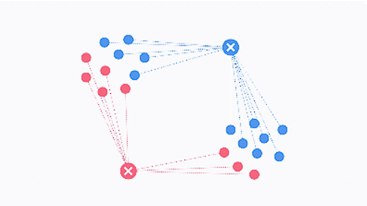
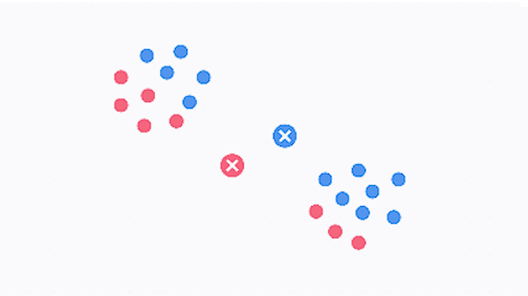
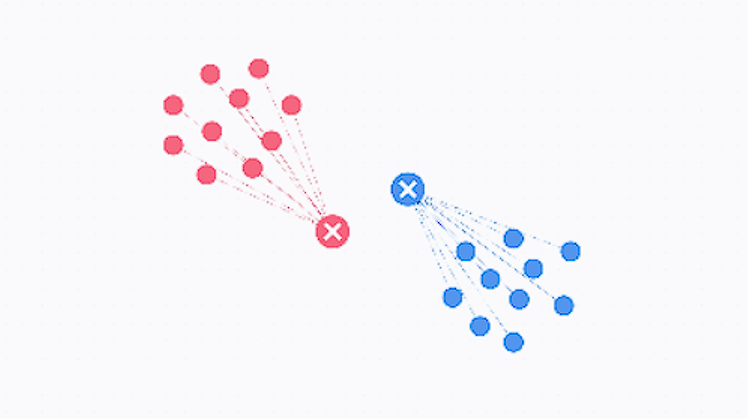
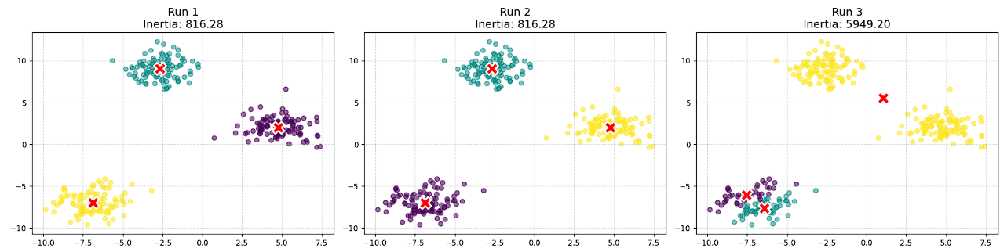
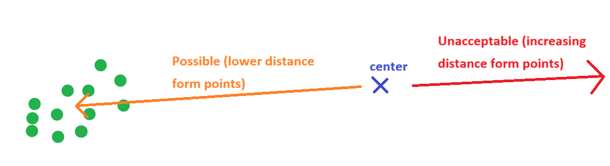
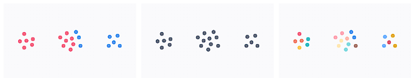
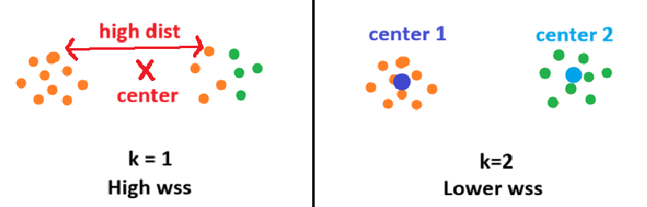
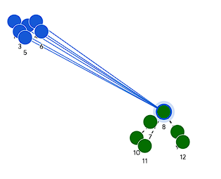
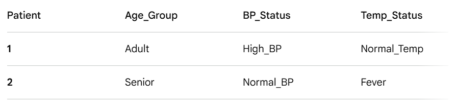

# Unsupervised Learning

In this chapter, let's see how we can label data points when we don't have clear answer for model to test out their performance. As we discussed during the meeting, unsupervised learning group similar points by "how close/similar they are" on the space. If we have points like (1,1), (1,2), and (1, 100), and two types of data, we can say first two points are probably same type of data points while last one is different kind, since first two are way more closer than where third point is. Since we reviewed what clustering is, and how each models work during the meeting, we will only focus on how to code it. Please let me know if you would like more background/conceptual explanation to be uploaded.

First, let's read vitals csv to work with!

```{r}
library(dplyr)
library(tidyverse)

vitals <- read.csv("Vitals.csv") %>%
  select(-1)


head(vitals)
```

## Clustering

### K-means Clustering

#### Concept of K-means

While explanation is available in the slide, let's go over quickly. Again, core idea of K-means starts from the idea that "similar types of data will have similar feature values, so they will appear closer." However, calculating each points raises concern about "how do we know if two points are closer than others" due to lack of reference point. As solution, K-means compares the distance of point to randomly selected centroid (center point).

First, K number of centroids are randomly placed on the space.

{fig-align="center" width="246"}

Second, distance between each point to centroids are calculated. Each points are grouped with centroids closer to them.

{fig-align="center" width="246"}

Third, Centroids are moved to the center of the points with same group. For example, in the image above, centroid blue X will move to (average x coordinate of blue points, average y coordinate of blue points). This way, average distance between individual point and centroid decreases.

{fig-align="center" width="246"}

Forth, Step 2 and 3 are repeated. As cycle goes on, average distance decreases further.

{fig-align="center" width="246"}

Last, cycle stops when centroid ends up with same location two cycles in a row. This is when average centroid-points distance is minimized, which means that centroid is in the middle of cluster.

{fig-align="center" width="245"}

#### Running K-means

First, let's perform 2D PCA so that we can visualize clustering result in a way we can visually understand.

```{r}
# Extracting Numeric values only -> Standardizing it -> run PCA
pca_vitals <- vitals[, c("Age", "Temp_C", "Heart_Rate", "Systolic_BP", "Diastolic_BP", "Resp_Rate", "SpO2")] %>%
  mutate(across(where(is.numeric), scale)) %>%
  mutate(across(where(is.numeric), as.numeric)) %>%
  prcomp()

summary(pca_vitals)

ggplot(pca_vitals$x, aes(PC1, PC2)) + 
  geom_point()
```

Typically, R calculates distance between points using dist() function.

```         
dist(data range, method)

Default method is Euclidean distance, but there are many other methods such as Manhattan, Maximum, etc. Check slides for more methods!
```

```{r}
dist(vitals$Age[1:6])
```

Using dist(), we just calculated distance among first six Age values. However, calculating every single point pairs manually would be tiring. So, we have function that execute K-means clustering for us, using kmean() function within stat package. K-means goes in following steps (code wise). We will review each part of the code below.

```         
#1 Set seeds
set.seed(123) # Set random points around the data. you throw "seeds" like farmer

#2 Run the Elbow Method test
fviz_nbclust(target data, kmeans, method = "wss") +
  labs(title = "Elbow Method for Determining Optimal K") +
  theme_minimal()
  
#3 Set seeds again
set.seed(123)

#4 Run the K-means clustering and save the result
km_result <- kmeans(target data, 
                    centers = 3,      
                    nstart = 25)
                    
#5 Visualize the result
# Draw the final cluster map
fviz_cluster(km_result, 
             data = target data,
             palette = c("blue", "red", "green"),
             geom = "point",
             ellipse.type = "convex", 
             ggtheme = theme_minimal(),
             main = "K-Means Patient Segmentation (K=3)")
```

#### Step 1: Setting the Seed

Setting a seed is assigning potential starting points for Kmeans' initial centroid locations. This might sound counter intuitive because first step of Kmeans is to drop centroid randomly. So, why do we limit initial location since it's not truly random anymore?

Technically, you can run K-means without setting seeds. But, there are important issues with this no-restraint approach.

1.  Reproducibility

One most important thing in data analysis is reproducibility. If first run groups 11 points in cluster 1, but 17points in cluster 2..., and never be able to repeat consistent result, we run into credibility issue. If result is different every time, how do we confirm that the analysis is precise/accurate? No one can replicate the analysis done so that there is no way to confirm the analysis is trustworthy. Now, your fascinating finding goes into trash can.

Figure below is few runs of K-means on the random data set.



While first two looks identical, third one shows complete different clustering. Like that, initial positions of centroid might influence clustering result. To ensure reproducibility, we need to set initial points where centroid can start. But we still want them to be somewhat random, so we set lots of seed (123 in the code we use). This way, we are still allowing ranodmness start without telling the code "you must start on this exact same location every time."

2.  Local vs. Global blindness

Let's look at third run from the figure above more in detail. It looks like two centroids are dividing one one group of points instead of each centroid centering in each groups. This is because K-means is blind. K-means' goal is straight forward: "centeroid's average distance to points must be smaller than previous iretation." It only cares about reducing distances further, without caring where those centroids are actually located. why does this matter?

Let's say initial centroid drops like this, by rare chance: One in between two clusters (where centroid of yellow cluster is), two within one cluster (centroids for green/purple clusters).

Will centroids within the cluster ever move to another cluster? No. Because Kmeans focus on reducing 'distance from current state,' it will move closer to center of the points within the same label. But look at the third figure. If centroid moves to another group of points, distance with current group increases.



That said, two centroids in same cluster will never move outside of that cluster, but will try to split single cluster into two parts (and that's what happened in the third plot). So even each centeroid taking each cluster is best way to group them, model only focuses on local (current state) that they are blind to 'truly best scenario.'

To prevent this localization, we limit number of potential starting point using set.seed(123). Now, because 123 points are way lesser than infinite possible coordinates, there is lower chance of having localization issue.

As result, first step of Kmeans is to set seeds.

#### Step 2: Defining k

Defining number of centers for clustering is important.



If we have too less centers (left picture), one group of points will belong to two different clusters. On the other hand, if we have way too many, we will see clustering within the group (right picture). So, how to we determine how many centers are optimal? It might sound counter intuitive, but we determine k by running kmeans with multiple different number of k. What does it mean to run kmeans before determining k?

After k means, we evaluate quality of clusters through WCSS (within cluster sum of square), which is sum of square of distance among points within same cluster.

If there are lower number of centroids than actual clusters, WCSS will be high since distance of points in different groups will be included. On the other hand, as number of centroid increases, cluster points are closer to each other and WCSS will decrease.

Let's plot WCSS and interpret together. When you run the code below, pay attention to the target data. pca_vitals, if you recall, is a pca result to full vital signs data frame, meaning Kmeans is trying to cluster int 3D+ diemsnion space. However, in the beginning of this chapter, we said we are trying to cluster in 2D space. This scope difference means we need to state that we will use only first two PCs throughout clustering.

```{r}
library(factoextra)

#1 Set seeds
set.seed(123) # Set random points around the data. you throw "seeds" like farmer

#2 Run the Elbow Method test
# second argument, kmeans, states that we are clustering using kmeans method
# thurd argument, method =, states that we are evaluating compactness of cluster using wcss method

fviz_nbclust(pca_vitals$x[, c("PC1", "PC2")], kmeans, method = "wss") + 
  labs(title = "Elbow Method for Determining Optimal K") +
  theme_minimal()
```

How to read this plot is similar to scree plot we saw in the PCA chapter. If wss is high (y axis), it means points are far away - indicating that points from different groups might be labeled as same cluster. As number of kluster increase, you see huge decrease in wss (k = 2\~3). This means that k = 1 clustered points in different group, and that having extra centers was correct move to cluster.

{fig-align="center" width="431"}

As k goes high (right end of the plot), you start to see wss decreasing much smaller than the beginning of the plot. This is because of overfitting, splitting clusters within-group as we saw earlier. Because there isn't much distance between nearby clusters, wss barely changes.

So,

huge decrease - addition of new clustering center does make appropriate partitions\
small decrease - addition of new clustering center caused overfitting

That said, we k value just like how we decide number of PC plot: we look for elbow, where adding clustering center start to have no significant meaning.

However, this can be highly subjective depends on how everyone sees the 'elbow' is. This issue becomes more trickly as we work with higher dimension data, as more random-looking spread will create smooth curve rather than elbow shape we just saw. Run wcss using full data set, and see if you can understand this difference.

```{r}
set.seed(123) 

fviz_nbclust(pca_vitals$x, kmeans, method = "wss") + 
  labs(title = "Elbow Method for Determining Optimal K") +
  theme_minimal()
```

Compare k = 1\~4 region. Doesn't it look like smoother curve? If unclear elbow appears, we move onto next step: silhouette method.

While WCSS method only measures "how tight the cluster is," which caused overfitting issue as it's blind to "how far clusters are," Silhouette method measures both intra-cluster cohesion and inter-cluster separation.

{fig-align="center" width="283"}

$$S(i) = \frac{b(i) - a(i)}{\max(a(i), b(i))}$$ b(i) (Seperation) - The average distance between point $i$ and all points in the nearest neighboring cluster. We want this to be as large as possible.

a(i) (cohesion) - The average distance between point $i$ and all other points in its own cluster. We want this to be as small as possible.

That said, score S(i) can be interpreted as follow:

Near +1: Perfect. The point is sitting right in the middle of a tight cluster, far away from any other clusters.

Near 0: Danger. The point is sitting exactly on the boundary edge between two different clusters.

Near -1: Misclassified. The point is actually closer to a neighboring cluster than it is to its own!

If this scoring system is not clear, try to imagine/draw scenario where scores are 1, 0, and -1.

To run this code, you don't need any other new package. factoextra already has it! Since Silhouette scoring is another method to score the clusters, we just need to switch the method argument. Everything else stays same as WCSS calculation.

```{r}
set.seed(123) 

fviz_nbclust(pca_vitals$x[, c("PC1", "PC2")], kmeans, method = "silhouette") + 
  labs(title = "Elbow Method for Determining Optimal K") +
  theme_minimal()
```

When you execute this method, plot draws a verticle dotted line to indicate which number of k had highest score, meaning that would be k value you want to use. Compare it to the WCSS and see if you can agree or not.

#### Step 3: Running K-means

Now we know optimal number of clusters, we just need to run and save kmeans() result!

```{r}
#3 Set seeds again
set.seed(123)

#4 Run the K-means clustering and save the result
km_result <- kmeans(pca_vitals$x[, c("PC1", "PC2")], 
                    centers = 3,      
                    nstart = 25)

km_result
```

Before we look into each components in the result data frame, two points to pay attention.

1: Did you notice how we're initiating set.seed() everytime we run clustering? There is a huge secret behind set.seed().

In addition to explanation from earlier, there is one more secret to set.seed(). How do computer knows what is exactly random? Since it's a compilation of code and logic, how can random be truly random? That's right. Even it looks like 'random' to human eye, random generator still have its 'algorithm' to generate randomness - so, it's not 100% random. So, everything you use set.seed(123), you will get exact same 123 coordinates. If you use set.seed(84)? Every single time you use set.seed(84) will give us same coordinates. So, assigning set.seed() preserve identical 'possible starting centroid position' every single time - Again, reproducibility maaters.

2: Besides target data and k value, you see 'nstart = i' argument. That argument means 'no matter how good result is, repeat centroid movement at least 'i' times" This is to make sure that we don't fall into 'global vs. local' issue we discussed earlier. By forcing algorithm to repeat process certain times, we force out localized result to review potential better options.

#### Step 4: Understanding Result

Now, let's look at each components of result.

```{r}
str(km_result)
```

It says result is made out of 9 lists, meaning there are 9 things we should understand!

1)  clusters

```{r}
km_result$cluster 
```

Cluster is where you see label of kmeans() result. It indicates which data point falls into which cluster. For example, 1st point is in cluster1, 2nd point is in cluster2, etc.,

2)  centers

```{r}
km_result$centers
```

Centers shows the coordinate of centroids. For example, center of cluster 1 is at (PC1, PC2) = (-0.56..., -1.11...)

3)  totss

```{r}
km_result$totss
```

TOTal Sum of Squares, is sum of distance square. This means, it's a sum of (distance between all data point pairs)\^2, which is sum of all variance!

4)  withinss

```{r}
km_result$withinss
```

This is Within-cluster Sum of Squares. Yes, it's wss/wcss score we saw earlier, but per cluster! Here, wcss of cluster 1 is 27, while cluster 3 is 40. From those numbers, we can tell cluster 3 is much wider than cluster 1.

5)  tot.withniss

```{r}
km_result$tot.withinss
```

This is sum of withniss across all clusters. This is the score we saw in elbow method.

6)  betweenss

```{r}
km_result$betweenss
```

Between-cluster Sum of Squares. Now we know what Sum of square is. So between-cluster ss means, variance among clusters! Since good clustering shows clusters seperated far away, you want this number to be highest.

7)  size

```{r}
km_result$size
```

Size is just count of how many points are there within cluster. There are 32 points in cluster 1.

8)  iter

```{r}
km_result$iter
```

Iteration means how many times centroid moved before algorithm stops. So, 3 means algorithm reached to result on the 3th re-location of centroids.

9)  ifault

```{r}
km_result$ifault
```

This indicates whether algorithm faced mathmatical limitation or unexpected error. 0 for complete completion, 1 for error happened.

#### Step 5: Visualizing result

##### \~4D PCA

After saving result, what we want to gain from kmeans is to find if we can find characteristic per cluster as clustering itself doesn't tell us who they are. While we can do detailed analysis by extracting result into sepereate data frame with further statistical analysis, there is easier way for general inspection: we can just plot them.

Simplest way is to use our factoextra package. It actually has auto plotting function for PCA and kmeans! Or, we could manually use ggplot() way too. Review the code below and see if you can explain what each argument is doing.

```{r}
# 1. factoextra
# geom = "point" within fviz_cluster() hides index of each point. If you plot without it, it shows index of each points on the plot.

fviz_cluster(km_result, data = pca_vitals$x[, c("PC1", "PC2")], geom = "point") +
  theme_minimal()

fviz_cluster(km_result, data = pca_vitals$x[, c("PC1", "PC2")]) +
  theme_minimal()

#2. ggplot
ggplot(pca_vitals$x[, c("PC1", "PC2")], aes(x = PC1, y = PC2)) +
  geom_point(aes(color = as.factor(km_result$cluster)), size = 3, alpha = 0.7) +
  geom_point(data = km_result$centers, shape = 8, size = 6, color = "black", stroke = 1.5) +
  labs(title = "K-Means Clustering", color = "Cluster") +
  theme_minimal()
```

Quick coding question: In ggplot way, why do we need as.factor() for color argument?

Now with colored clusters on the PCA plot, and knowing loadings for each PCs, we can kind of tell what's happening within each clusters. What are some characteristics of each of them? Are they old patients, high blood pressure, or do you notice anything else?

##### Higher Dimension

But we can always perform clustering on the raw dataset. What if we want to visualize kmeans() result with 10, 20, even more features? Then, instead of plotting into PCA space, we can compare center coordinates of each features. Which is, cluster 1 will have average/center values for feature 1\~x, cluster 2 will also have center values for feature 1\~x, and so on. Each cluster can be drawn into line graph.

For that, we need to use another gg family, GGally. Just like ggplot() we stack layers besides few differences in argument structure. Let's visualize it after performing kmeans() to raw data set.

```{r}
#install.packages("GGally")
library(GGally)

# 1. Prepare your raw data and run the model (Your code is perfect here!)
raw <- vitals[, c("Age", "Temp_C", "Heart_Rate", "Systolic_BP", "Diastolic_BP", "Resp_Rate", "SpO2")]

# Note: It is highly recommended to scale() your raw data before running K-means, 
# otherwise features with large numbers (like Systolic_BP) dominate the math!
km_raw <- kmeans(raw, centers = 4, nstart = 25) #Randomly picked 4 for centers. No reason

# 2. Convert the matrix to a data frame AND add a Cluster ID column at the front
centers_df <- data.frame(
  Cluster = as.factor(1:nrow(km_raw$centers)), # Creates a categorical label (1, 2, 3)
  km_raw$centers                               # Attaches the 7 vitals columns
)

# 3. Plot!
ggparcoord(centers_df, 
           columns = 2:ncol(centers_df), # Automatically grabs columns 2 through 8
           groupColumn = 1,              # Uses our new 'Cluster' column for color
           showPoints = TRUE) +
  coord_flip() +
  labs(title = "Cluster Profiles (Raw K-Means Centers)") +
  theme_minimal()
```

This way, even thought we cannot plot kmeans() result into visual plots that 'we imagine' (like 2D, 3D scatter plot), we can still see how each clusters differ. For example, in here, we see that cluster 3 is characterized by high resp_rate and HR.

## Association Rule Learning

### Concept of assocication rule learning

In short, Apriori algorithm, an example of association rule learning, is an algorithm that discovers "If this, then that."

In PCA or kmeans, we looked at how similar or different each points are. In association rule learning, we are looking at how two are related by counting 'co-occurance,' ignoring the geometry we've been using. It scans for countless of events that happened together, and creates a rule in 'antecendent -\> consequence' format.

Let's walk through how it works with clinical example. Typically, we say

```         
If patient have high blood pressure -> Beta blocker is prescirbed

A - Having high blood pressure
B - Getting beta blocker 
```

Is this true? Let's figure it out.

Association rule learning basis on three mathmatical pillars.

#### Support

Support asks, "How popular is the rule?"

For example, support(A) is frequency of A in entire population.

In our case, support(A and B) means, how many people have high bp and prescribed beta blocker out of total clinic population.

$$Support = \frac{\text{Patients with A and B}}{\text{Total Clinic Patients}}$$ If support is high (\> 20%), it means combination is extremely common. It's a good signal that the relationship might be potential public general trend, worthy exploring further.

If support is low (\< 5%), the relationship might be random noise. However, it also could be rare case that no one really discovered. Typically, we filter out low-support rules unless we are intentionally looking for rare patterns.

#### Confidence

Confidence asks, "How reliable is the rule?"

Here, we look for how frequent both event happens when context (A) happens. In our example, it would be 'From hypertensive patients, how many of them are both hypertensive and received beta blocker?'

(Compared to support, the scope is different. Support asks A and B from total population, confidence asks A and B from population with A).

$$Confidence = \frac{\text{Patients with A and B}}{\text{Total Patients with A}}$$

Confidence is like a predictive power. Since it answers "if condition A is met, how much can I trust/predict that B happens,'

high confidence (\> 80%) means that the rule is highly reliable (if A happens, almost certainly B happens).

low confidence (\< 50%) means that the rule is coin flip or worse. As result, it was a coincident observation but not a rule.

#### Lift

Lift connects support and confidence. In support, we looked at 'how often something happens from total population,' which servces as a baseline. In confidence, we looked at 'If context happen, how likely result happen.'

So, if we compare 'how often result happens' to 'how often result happens becuase of context happen,' we can determine if two are related.

It's little confusing to read through text, let's go through in case of our example.

$$Lift = \frac{Confidence}{Support(B)}$$

Confidence - how likely "hypertensive" patient receive beta blocker

Support(B) - how likely "anyone in the clinic" patient receive beta blocker (for whatever reason)

So, if lift \> 1 or \< 1, it means existance of hypertension did change chance of getting beta blocker, proving the association between two factors (hypertension and beta blocker prescription in this case).

However, if lift is 1, it means patient's hypertension status did not change chance of getting beta blocker at all, rejecting association between two.

Typically, we say abs(lift) \> 3 indicates strong correlation, and strong enough that context event dictates/aggressively drives consequence event. This is certainly something we want to report.

If abs(lift) is 1.5 - 3.0, this is still solid assocation between two, indicating there is a relationship between two events.

If abs(lift) is 1.0 - 1.2, we consider this as coincidence. Here, even though context event might created influence in consequence event, we say the association is not strong enough to be recognized.

In summary, we look at the three values to evaluate association between two events:

1.  High support + High confidence + High lift: This is very common and reliable rule that indicates strong pattern. We highlight these in the report.

2.  High support + High confidence + Lift = 1: This is trap. Even though two events happens together often, it's because both are just incredibly common, not because they are associated. We ignore these.

3.  Low support + High confidence + High lift: You sniped rare pattern. This is strong, reliable pattern that applies to specific subset of your population. This becomes useful when you're trying to look for targeted initivatives, such as specialized care or rare disease tracking.

4.  High support + Low confidence: This is dead end. Regardless of lift value, low confidence means two events might be common, but context event is not predictor of consequence event. We also ignore this.

### Running Assocation Rule Learning

You could calculate each parameter manually, but we have package called "arules" (for running the algorithm) and "arulesViz" (for visualizing result).

But before we use the package, there is one pre-processing we must do. Association rule learning is finding relationship "A happens, B happens." But let's go back to example we looked at. What is systolic blood pressures are considered high? 130? 131? 90? We must feed the model 'labels,' such as high/mid/low bp, not a raw numbers, like 130 or 140.

Important: For this model to work, you must put values into categorial buckets.

In this section, we will use only age, BP, and temperature for sake of code length and walkthrough time.

#### Pre-processing data

```{r}
# Don't forget to install packages!
# install.packages("arules")
# install.packages("arulesViz")
library(arules)
library(arulesViz)
library(dplyr)

# Convert continuous clinical data into categorical "buckets"
rule_ready_vitals <- vitals %>%
  mutate(
    # Convert age into distinct demographic buckets
    Age_Group = case_when(
      Age < 30 ~ "Young_Adult",
      Age >= 30 & Age <= 60 ~ "Adult",
      Age > 60 ~ "Senior"
    ),
    
    # Convert BP into clinical risk categories
    BP_Status = ifelse(Systolic_BP > 130, "High_BP", "Normal_BP"),
    
    # Convert Temp into fever status
    Temp_Status = ifelse(Temp_C > 38.0, "Fever", "Normal_Temp")
  ) %>%
  
  # Drop the original numeric columns, keeping ONLY our new text categories
  select(Age_Group, BP_Status, Temp_Status) %>%
  
  # Apriori strictly requires all columns to be formatted as 'factors' (because of reason we discussed)
  mutate(across(everything(), as.factor))
```

Once we change everything into categories, there is one more thing to do.

Data frame, is a rigid grid where cell with column (feature) and row (observation) contains specific value. However, in this model, we want to look at how features are related to other features So, instead of "patient 1 has feature A in one cell, feature B in another cell,...," we want to have data structure that "patient 1 has feature A,B,..." in single cell.

This way of containing multiple values in one cell, like a shopping basket, is called transaction.

Data frame:

{width="365"}

Transaction:

{width="352"}

So, let's change our rule_ready_vitals into transaction.

```{r}
# 1. Convert the factor dataframe into a "transactions" format
clinical_transactions <- as(rule_ready_vitals, "transactions")

# Let's take a quick peek at what the first 5 patient transactions look like
inspect(clinical_transactions[1:5])
```

Now, we are ready to run the model!

#### Running Apriori

While Apriori() runs the association rule learning algorithm, there are some arguments used. 

```
apriori(target data, parameter = list(supp = x, conf = y, maxlen = z))
```

Do you recall that we want to have minimum support and confidence levels to disregard random noise? All those filter settings goes into 'parameter = ' argument in list format. maxlen, is the maximum number of tags that can be put in single rule. 

Here is how the counting works in practice using your clinical data:

Length 2: {High_BP} => {Fever} (1 tag on the left + 1 on the right)

Length 3: {Senior, High_BP} => {Fever} (2 tags on the left + 1 on the right)

Length 4: {Senior, High_BP, Male} => {Fever, Prescribed_Antibiotic} (3 tags on the left + 2 on the right)

By setting maxlen = 4, you are telling R to completely ignore any pattern that requires 5 or more tags to be true. This is because combinations to explore increase exponentially as you consider more tags at once, decreasing calculation efficiency or even eventually overwhelming/breaking R.

Then, let's run the algorithm.

```{r}
# 2. Run the Apriori algorithm
# Let's cast a wide, standard clinical net: Minimum 5% support, Minimum 60% confidence
# maxlen = 4 prevents the rules from getting too long and complicated to read
clinical_rules <- apriori(clinical_transactions, 
                          parameter = list(supp = 0.05, conf = 0.60, maxlen = 4))

# Check how many rules the algorithm successfully found
clinical_rules
```

#### Understanding the result

So there are multi lines of results. This is like receipt of the algorithm. Let's look at it line by line.

First is parameter specification. This is where it shows the settings you used. For example, you see the 60% confidence and 5% support filter you set. 

Second is Algorithmic control. This is how computer handled the calculations. We can skip this as it doesn't explain our rules found, but you can Google them any time. 

Third is Absolute minimum support count. This is the number of minimum count you need to be considered as potential rule based on the total population. This makes sense since 5% of 100 entires (we have in raw data) is 5.

Then, the last is log of what happened. At the end, it says algorithm found 19 rules!

Let's look at the top rules (from highest to lowest lift) it found.

```{r}
# Look at the rules we found
inspect((sort(clinical_rules, by = "lift")))
```

Well it looks like all rules it found results in "normal + something," which is clinically not so meaningful. Why does this happen, why do rules ends up patient is normal? 

This is a good example of class imbalance. If we look at the raw data set, there are patients with high blood pressure or temperature. 

```{r}
summary(rule_ready_vitals)
```

But, because those 'sick' patients are much smaller than normal people, algorithm thinks "it's by chance" and disregard them. 

#### Shaping the result

So, in rule association learning, we can force algorithm to look for association around specific results we want to see (so that we can find meaningful association). we do this by using argument called 'appearance='

```
appearance = list(default = "lhs", rhs = c("BP_Status=High_BP", "Temp_Status=Fever")))
```
the flow is 'lhs -> rhs' By setting sick conditions as result, we are forcing model to find rules behind sick patients. 'default =' means we are using everything in the fed data set. In this case, lhs (context) can use all tags in the data set. 

```{r}
# We lower the confidence slightly to catch harder-to-find clinical patterns,
# and strictly force the Right Hand Side (rhs) to only show us the risks.

targeted_rules <- apriori(clinical_transactions, 
                          parameter = list(supp = 0.01, conf = 0.40, maxlen = 4),
                          appearance = list(default = "lhs", 
                                            rhs = c("BP_Status=High_BP", "Temp_Status=Fever")))

# Sort and inspect the new targeted rules
inspect(head(sort(targeted_rules, by = "lift"), 5))
```

Now, it still says "writing ... [0 rule(s)] done" There are some reasons that can explain this. One, is that age is not a good predictor for BP status (In real world, it can be. Remember, data set we are working right now is randomly generated, so it does not reflect real world trends). Second, is that we have only one fever patient, meaning it is too small to establish meaningful rule. When this happen, you want to increase maxlen, review how data are put into basket, or conclude, "there is no meaningful association." 

Now, try it using our 2025 patient directory!