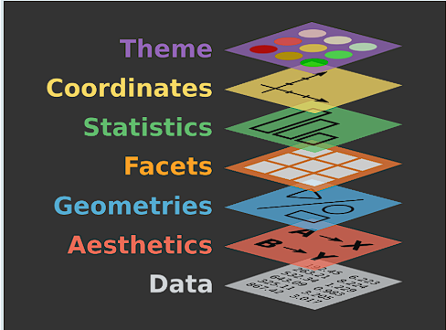
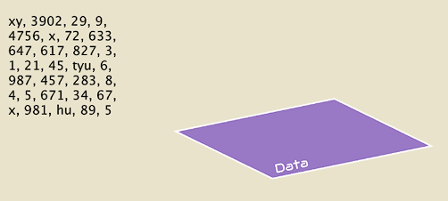
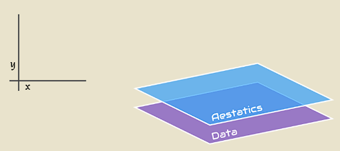
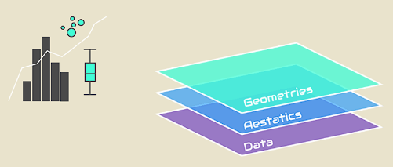
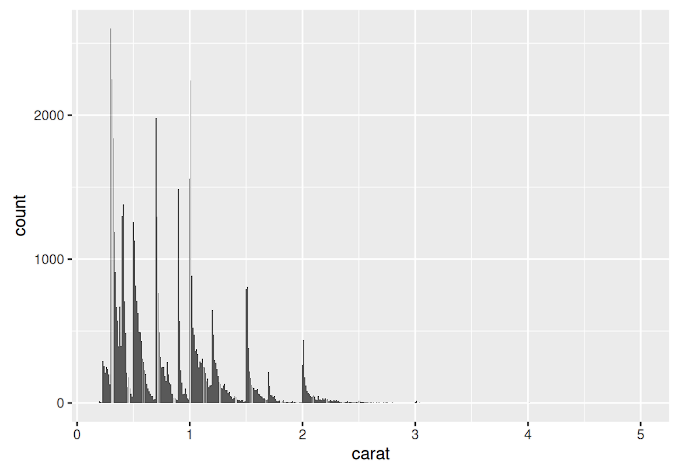
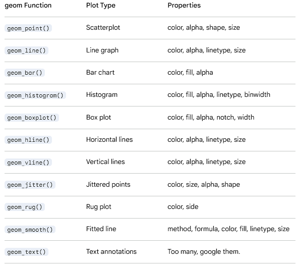

# Vizualizing Data with ggplot2

Last chapter, we learned how to organize, clean, and manipulate tidy data. In this chapter, we will use another package in tidyverse, ggplot2 package, to learn how to vizualize data.

First, let's load ggplot2 package. Just like dplyr, we need to call for tidyverse.

```{r}
library(tidyverse)
```

## Components in ggplot2()

ggplot is like a grammer, in a sense that you stack multiple layers to produce a figure.

ggplot() itself tells R, "here's an empty canvas." But, you must define each components to come up with one figure. What variables are we using? What values are we plotting? What type of figure are we using?

There are multiple layers of component that defines those:



Three main (mandatory) components are:

1.  Data \| data = : This is component where you state the data frame you will use to plot

    

2.  Aesthetics \| aes(x=,y=,color=, ...) : This layer defines visual components of the plot. These includes axis, color and size of data points, and more.

    

3.  Geometry \| geom_x() where x can be multiple modes : Defines what method you will use to visualize, like line graph, bar graph, etc,.

    

Others are accessory components, as they help readability of the graph but not mandatory.

### Three Mandatory Components

Now, let's start drawing our first ggplot() using mpg dataset we used last time.

```{r}
ggplot(data = mpg) + 
  aes(x = displ, y = hwy) +
  geom_point() 
```

First, let's understand the graphic.

Take a look at the downward trend of the dots. In this dataset, displ represents the car's engine displacement (engine size), and hwy represents its highway fuel efficiency.

Notice that they are inversely proportional. Does this make sense? Yes! As engine size increases on the X-axis, the engine requires more fuel per cycle to run. This burns more energy, resulting in significantly lower fuel efficiency (MPG) on the Y-axis.

Second, let's look at how this graph is built.

Remember how we're stacking different layers of functions to create one figure? We use "+" to connect different layers.

Then, Let's break down the three layers of our code:

Layer 1: The Canvas (ggplot(data = mpg))

This is our base sheet. We are telling R to initialize the chart and specifically use the raw mpg dataframe as our starting material.

Layer 2: The Blueprint (aes(x = displ, y = hwy))

This is our aesthetic sheet. We haven't drawn any shapes yet, but we are telling R to draw the gridlines: map engine size to the X-axis, and highway efficiency to the Y-axis.

Layer 3: The Paint (geom_point())

This is our geometry sheet. Now that the data and gridlines are set, we finally tell R to pick up the "dot" paintbrush and stamp the physical shapes onto the canvas.

Like this, ggplot() combines layers of component (ggplot(), geom(), etc) that contains details (data =, x =, etc).

## mapping Argument

When you run a stack of layers, R reads your code from top to bottom, but it doesn't actually draw anything until it reaches the very end. For our previous example, R reads the canvas ggplot(), reads the gridlines aes(), reads the paintbrush geom_point(), and then executes everything at once. Because of the way R reads the code, there is IMPORTANT point to remember.

Trap: it can hold only single layer of same-type.

Let's demonstrate the trap by adding second type of plot.

```{r}
ggplot(data = mpg) + 

# First plot 
  aes(x = displ, y = hwy) +
  geom_point() +

# Second plot
  aes(x = displ, y = cty) +
  geom_line()
```

Since geom_point() uses first aes() (hwy) and geom_line() uses second aes() (cty), you would expect that code to give two distinct graphs. However, when you run the code, you recognize both dot and line uses cty as y values. Where did first aes() (hwy) go?

This happens because R updates master snapshot as it reads from top to bottom, and execute the everything at once it finishes reading the code. So, even R sees first aes(), second aes() overrides it (this is what it means by ggplot() only holds single layer of identical type). By the time R reads all code, we're left with second aes() (cty), geom_point(), and geom_line() that both graph uses same x&y values.

Then, how do we prevent this issue? We use argument called mapping.

Mapping, is a bridge that connects visuals to the data. So while aes() is a visualization layer, "mapping = aes()" allows visual layer to be a detail of data layers.

Connecting data and visual means we don't have to leave aes() as seperate layer. Instead, we could use it like a detail of other layers. Let's look at the example below.

```{r}
ggplot(data = mpg) + 
  geom_point(mapping = aes(x = displ, y = hwy)) +
  geom_line(mapping = aes(x = displ, y = cty))
```

Different to plot we saw earlier, where both geom_point() and geom_line() uses aes(x=displ, y=xty), each plot uses different y values as we intended. We can compare what ggplot() ends up with at the end of the code, we can understand why this happened.

1.  aes() as seperate layer\
    geom() #1 : geom_point() using aes() layer\
    geom() #2 : geom_line() using aes() layer\
    aes() : aes(x = displ, y = cty)\
    Result : both geom() draws using aes(x=displ, y = cty)

2.  using mapping = aes()\
    geom() #1 : geom_point() using mapping = aes(x = displ, y = hwy)\
    geom() #2 : geom_line() using mapping = aes(x = displ, y = cty)\
    Result : each geom() have unique aes()

By making aes() a detail rather than seperate layer(), now we can plot multiple geom() using multiple dataset.

### Global versus Local mapping

If we can make aes() as argument within geom(), can we also do the same within ggplot()? Answer is yes. Let's look at the example below.

```{r}
ggplot(data = mpg) + 
  geom_point(mapping = aes(x = displ, y = hwy))

ggplot(data = mpg, mapping = aes(x = displ, y = hwy)) + 
  geom_point()
```

Compare two plots. Don't they look the same?

ggplot() is a global layer, while other layers are local layers. It means that any argument in ggplot() becomes a default for entire code. Now let's review the second ggplot() again. In ggplot(), aes(x=displ, y=hwy) sets global default aes() for everything else. So even though geom_point() didn't have aes() that defines x and y values, it looks back at ggplot() and use global aes() to draw graph.

On the other hand, in first ggplot(), there is no global aes() decalred. However, geom_point() has its own local aes() that it still can draw graph.

What if we have both global and local mapping?

```{r}
ggplot(data = mpg, mapping = aes(x = displ, y = cty)) + 
  geom_point(mapping = aes(x = displ, y = hwy)) +
  geom_line()
```

Here, we get different plots again. But it does make sense, let's look at line by line.

First line, we set global aes() with y values of "cty". In the second line, geom_point() has its own aes() with "y = hwy." Therefore, geom_point() use its local mapping. In the third line, geom_line() doesn't have any aes(). Now, it checks back at global mapping ad use aes() with "y = cty." Therefore, we get one with hwy as y value (geom_point with local aes) and another with cty as y value (geom_line with global aes).

One point of common confusion: global doesn't mean "universial law." It's just default. layers will prioritize local mapping if they have their own. Only when they lack settings they need, global mapping will be used.

## aes()

Now, let's look at details about aesthetic layer. As aes() defines visuals like shape, color, etc., there are many argument. Adding them is simple, as they're just extra argument within aes(). Below, we'll demonstrate how they look like.

### color

If multiple different individuals are visualized on the same graph, you might want to differentiate them using color.

```{r}
ggplot() +
  geom_point(data = mpg, mapping = aes(x = displ, y = hwy, color = class))
```

Class in mpg data frame was the type of cars. As shown in the figure, each data point with different class are plotted with different colors.

### shape

similar to color, we can use shape argument to differentiate data points

```{r}
ggplot() +
  geom_point(data = mpg, mapping = aes(x = displ, y = hwy, shape = class))
```

While shape differentiates the car class, do you see the warning sign? This is because there are finite number of shapes available. If we have 1000000 categories (e.g., continuous number range) but only have 60 shapes, we can't assign unique shapes to every single categories. In fact, we don't even have a shape assigned for suv. In that case, color might be better fit since there are much more available colors.

### size and alpha

Size controls size of the data points, and alpha controls transparency of the data point. This time, let's use continuous data, displ.

```         
# Too many shapes needed for continous data, so it will return error. Try running this code
ggplot() +
  geom_point(data = mpg, mapping = aes(x = cty, y = hwy, shape = displ))
```

```{r}
# Using size 
ggplot() +
  geom_point(data = mpg, mapping = aes(x = cty, y = hwy, size = displ))

# Using alpha
ggplot() +
  geom_point(data = mpg, mapping = aes(x = cty, y = hwy, alpha = displ))
```

Of course, you can use multiple arguments at once.

```{r}
ggplot() +
  geom_point(data = mpg, mapping = aes(x = cty, y = hwy, shape = drv, color = displ))
```

### Manually Setting Arguments

So far, arguments set colors/size/etc for you automatically. For example, if we wanted color based on the type of displ, we would put color = in aes() (visual factor of each point).But sometimes, you want to set colors or size manually. Like, "plot all points blue regardless of what kind of data it is."

```{r}
ggplot() +
  geom_point(data = mpg, mapping = aes(x = displ, y = hwy), color = "blue")
```

In the plot above, look at where "color = " is located. When you put "color = " in aes(), which differentiates type of value, you're assigning colors per type. However, if you put "color = " outside of aes(), you're telling geom_point() "Ignore boundaries. Plot all points using blue."

What will happen if you accidentally put "color = blue" in aes()?

```{r}
ggplot() +
  geom_point(data = mpg, mapping = aes(x = displ, y = hwy), color = "blue")
```

Why do you see red dots here? Because you put color argument in aes(), ggplot() thinks there is a column that saves information called "blue" and try to assign color based on values in "blue" (in reality, we don't even have column called "blue"). So, data points are assigned with random color instead of blue you intended.

### group

So far, we only looked at geom_point(). While we will talk about other types of graphs more later on, let's look at geom_line().

For better demonstration of why I'm bringing up geom_line in aes() section, let's use different data set other than mpg. 'Orange' data set tracks age and circumference of different trees.

```{r}
Orange
```

```{r}
ggplot(data=Orange) + 
  geom_point(mapping = aes(x = age, y = circumference, color = Tree))
```

Here, we see a clear linear relationship between age and circumference per tree. Let's draw a line graph to make this different growth per tree clear!

```{r}
ggplot(data=Orange, mapping = aes(x = age, y = circumference)) + 
  geom_line() +
  geom_point(mapping = aes(color = Tree))
```

The line graph doesn't look like what we expected. Instead of multiple lines per tree, we see a single line that connects all existing values from smallest to largest x value (age). Why is this happening?

In human eyes and brains, we think "oh each trees are unique, so we should connect lines using data from same tree only!" However, code only does what they are told.So when we map aes(x = age, y = circumference), ggplot thinks "I should draw single line graph using all data we got!" not knowing the data is mix of different trees.

So, we need to tell ggplot() to draw line per tree. For this purpose, we use "group = " argument within aes(). Look at Orange data set again. In Trees, each are labeled with unique numbers. Now, let's draw another line graph using this point.

```{r}
ggplot(data=Orange, mapping = aes(x = age, y = circumference)) + 
  geom_line(mapping = aes(group = Tree, color = Tree)) +
  geom_point(mapping = aes(color = Tree))
```

By using group argument, ggplot() knows which subset of data it should use to draw a accurate line graphs.

## facet

Let's revisit mpg data.

```{r}
ggplot() +
  geom_point(data = mpg, mapping = aes(x = displ, y = hwy, color = class))
```

Here, there were so many different car types that when we try to look for specific car's data, for example subcompact, it takes some time finding all data points that belongs to subcompact cars. Could we generate multiple plots using same axis, so that we can see plot per car class? That's where facet is used. When we segment a graph into multiple little graphs to plot subsets separately, we say we are plotting with facets.

Before we use facets, we need to understand operator "\~" It means "modeled by." There are two ways to understand how it's used.

1: As in equation (generally): One way that \~ is used is when you state relationship between two. So, y \~ x mean "Use x to explain y, or "y is function of x" For example, y = x\^2, we could say y \~ x.

2: As in geometry (for ggplot()): It's similar to way #1. When you try to plot something in 2D graph, you need one variable for X axis and another variable for Y axis. It's like drawing y = x\^2 onto 2D plot. So in this case, y\~x means y (everything left to \~) is variable for rows (Y axis) and x (everything right to x \~) is variable for xolumn (X axis).

Then what would facet_wrap(\~x) mean? ggplot() would draw facets of x, and x will be column.

### 1D facet

plotting with facets is divide into two steps: First, we draw draw graph with everything. Second, we divide plot (we call this wrapping) into facets.

```{r}
ggplot() +
  geom_point(data = mpg, mapping = aes(x = displ, y = hwy, color = class)) + #First we draw everything
  facet_wrap(~class) #Second we divide
```

Now, you see same plot but per specific car class. Also, do you see how \~class makes class category on the column names (y\~x)? If it's not clear, don't worry! 2D facet example later on will make it clear. If you want to set number of rows facets should be displayed, you can add nrow = argument.

```{r}
ggplot() +
  geom_point(data = mpg, mapping = aes(x = displ, y = hwy, color = class)) + #First we draw everything
  facet_wrap(~class, nrow = 2) #Second we divide, but display them in two rows
```

If you want to use multiple variable per plot, you can connect them using "+" just like how we stack layers in ggplot().

```{r}

ggplot() +
  geom_point(data = mpg, mapping = aes(x = displ, y = hwy, color = class)) + 
  facet_wrap(~class + drv, nrow = 2)# drv was wheel motion type, r (rear), f (forward), 4 (four wheel drive)
```

Now facets are not just based on the class, but combination of class and drv.

### 2D facet

But if you noticed, number of plots increase dramatically in 1D facet because you're displaying all possible combination of variables in single row, like a ribbon. However, readability of the ribbon will decrease exponentially as number of variable increases. For instance, graph we made just above, you need to read 12 different combination every time (which makes difficult to track which is which). So, we use 2D facet.

When you create 2D facet, facet_grid() is used instead of facet_warp(). Also, you use A\~B instead of \~B (because you need variable for both row/column direction in 2D, where as 1D only need one variable).

```{r}

ggplot() +
  geom_point(data = mpg, mapping = aes(x = displ, y = hwy, color = class)) + 
  facet_grid(drv ~ class)
```

Just like 1D facet, you can use combination of different variables.

```{r}

ggplot() +
  geom_point(data = mpg, mapping = aes(x = displ, y = hwy, color = class)) + 
  facet_grid(drv ~ class + year)
```

## geom()

Now, let's explore different types of plots in ggplot().

### Simple statistics to ggplot()

There are lots of geom() functions that fits different situations. First, let's look at some geom() that is helpful turning summarized statistics into plot.

#### Categorial Data ()

##### geom_col()

Here, let's see how we can plot number of cars in each car classes. How would you count number of cars in each class? Try it yourself! Hint: summarize()

```{r}
class_count <- mpg %>%
  group_by(class) %>%
  summarize(Count = n())

class_count
```

One way we vizualize categorial data is bar graph (since x axis, categorial variable, are not continuous data we can connect using line) using geom_col().

```{r}
ggplot(class_count) + 
  geom_col(aes(x = class, y = Count))
```

Nice looking bar graph! Except one minor hassle: for each bar graph, you need to calculate summarized stat every time. So, how do we make it easier?

##### geom_bar()

While both geom_col() and geom_bar() creates bar graph, there is one major difference: geom_bar() performs summarization for you. Let's look at how it works.

```{r}
ggplot(mpg) + 
  geom_bar(aes(x = class), stat = 'count')
```

Same looking graph, but using mpg data directly without summarize()! What was happening in the geom_bar()?

In aes(x=class), we tell ggplot() that our categorial varialbe (or x axis) will be class. stat = 'count' makes geom_bar() to count how many times each category shows up in the data set. In this case, count() counts how many "suv" exist in the class column of mpg, how many "subcompact" exist in..., and so on.

What if you want to use percentage instead of absolute count on the y axis? we add after_stat(prop) argument. Why after_stat() instead of stat()? stat() allows us to choose column in original data set, while after_stat() allows us to choose column of summarized data by geom_bar().

```         
Original Data (pick something in here using stat()) -> Summarized statistics (pick something using after_stat) -> Figure
```

```{r}
ggplot(mpg) + 
  geom_bar(aes(x = class, y = after_stat(prop), group = 1))
```

When you use prop, it is important to put 'group = 1.' It's because how geom_bar() calculates proportions. geom_bar() calculates them by looking at 'how many items meet condition/how many items in selected group' In that specific code, proportion is calculated by 'how many cars in class X/how many cars are there in selected group' Because we're calculating proportion from after_stat (where data are summarized in class - count manner), geom_bar() will look at 'how many cars are suv / how many cars are in suv category' : all class will return prob of 100%. So by labeling all cars same (giving tag '1' to everything), now geom_bar() calculates suv out of total cars.

#### Numerical Data

Using geom_bar() on continuous data creates too many columns, which makes us difficult understanding which column is what.

```{r}
ggplot(mpg) + 
  geom_bar(aes(x = displ))
```

Well you might say you can read each column. Okay, then what if we draw bar graph of number of diamond per carat?



Now, can you even tell how many different caract exist in the data set? probably not.

##### geom_histogram()

One handy way to show count of continuous data is to use histogram. Instead of displaying column per value, you can group them and display together. For example, putting everything with displ value of 1\~2 into single column. There are two ways to draw histogram. First, you can use geom_bar() with "stat='bin'" argument. Second, you can use geom_histogram().

```{r}
ggplot(mpg) +
  geom_bar(aes(x = displ), stat = 'bin')

ggplot(mpg) +
  geom_histogram(aes(x = displ))
```

I prefer to use geom_histogram() because of its capability to cusomize: You can change number of column (bins), or binwidth (range of each bin).

```{r}
ggplot(mpg) +
  geom_histogram(aes(x = displ), bins = 10) #Use only 10 bins

ggplot(mpg) +
  geom_histogram(aes(x = displ), binwidth = 0.1) #Group displ by increment of 0.2. 
```

Just like after_stat(prob), you can also draw density/proportion graph using after_stat(density). If you want normalized density (maximum value = 1), you can use after_stat(ncount) and after_stat(ndensity). n + something as Normalized + something.

```{r}
ggplot(mpg) +
  geom_histogram(aes(x = displ, after_stat(ncount)))

ggplot(mpg) +
  geom_histogram(aes(x = displ, after_stat(density)))
```

##### geom_boxplot()

Last, you can draw box plot that summarize quartiles of data set.

```{r}
ggplot(mpg) +
  geom_boxplot(aes(y = cty))
```

box plot is advantageous when you want to show the spread of the data.

y value: Data you want to show the spread\
Mid line of the box: 50% percentile (median)\
Lower line of the box: 25% percentile (Q1)\
Upper line of the box: 75% percentile (Q3)\
Distance between lower and upper line: Inter-Quartile Range (IQR)\
Vertical line: data within 1.5IQR\
Outliers: data outside of 'Q3 + 1.5IQR' or 'Q1 - 1.5IQR'\
Dots: Data points that are outlier

If you want to draw boxplot where spread is shown in the x axis, you simply need to change aes() to 'x='

When do we use boxplots? It becomes useful when you compare numerical value's statistics among categorical data. Earlier, we could compare the count of the car class. However, what if you want to compare cty of each classes? Even you draw histogram of numerical data (cty) for each categorial data (car class), comparing multiple graphs side to side is not easy. In this case, boxplot becomes handy.

```{r}
ggplot(mpg) +
  geom_boxplot(aes(y = cty, x = class))
```

Now, you can easily compare median values of cty of each class and IQR range to show 'which class is more efficient' easily.

\*Small Note box plot above makes comparison easy, but readability is low as median are in random order. We can use fct_reorder() (Review concept on factors!) to order classes based on cty values.

```{r}
ggplot(data = mpg) + 
  geom_boxplot(mapping = aes(x = fct_reorder(class, cty), y = cty)) 
# in fct_reorder, We're ordering class using median cty value. 
# fct_reorder(A, B) A: Data you want to order, B: Function you want to use for ordering (default is median)
```

#### Visual of bar graphs

As we saw earlier, we can edit color of bar graphs. First, let's try changing color of all bars. Rememer when to put argument in and out of aes()? If you want to change all colors regardless of features (classes, drv, etc), where should you put the argument?

In bar graph, there are two separate colors. Color for the border of bars uses 'color' argument, while color of bars themselves uses 'fill' argument.

```{r}
ggplot(mpg) + 
  geom_bar(aes(x = class), stat = 'count', color = "red", fill = 'green')
```

Now, what if you want to see count of drv per class? In this case, we should use multiple colors per bar to show different drv types within the bar (feature dependent). In this case, should color/fill argument go in or outside of aes()?

```{r}
ggplot(mpg) + 
  geom_bar(aes(x = class, fill = drv)) 
#small note: default stat() of geom_bar is count. So you can omit stat = 'count'
```

Pause, one question. Some might say "Stacking all drv types into single column makes count difficult to read. I want to be able to read each drv counts easily." Valid challenge accepted. Since we asked ggplot() to create bar graph based on class and count, each bars only shows how many class X exist - no matter how many forward, or rear wheel cars are within that column. So, for people who want to see those minor details, we can separate column by details using 'position' argument.

Here's option for position argument:

stack: This is the default of position argument. It "stacks" one on the top of another.

```{r}
ggplot(mpg) + 
  geom_bar(aes(x = class, fill = drv), position = 'stack')
```

dodge: Place different sub-types (drv in this case, where fill color is differentiated) next to each other.

```{r}
ggplot(mpg) + 
  geom_bar(aes(x = class, fill = drv), position = 'dodge')
```

fill: Show percentage of each sub-type within the column. Which means, all column will be fixed at 1.0 (since combining all percentage of sub-types within the column will be 100%)

```{r}
ggplot(mpg) + 
  geom_bar(aes(x = class, fill = drv), position = 'fill')
```

identity: Put all sub-types starting from y = 0.

```{r}
ggplot(mpg) + 
  geom_bar(aes(x = class, fill = drv), position = 'identity')
```

For the graph above, do you see how four wheel drive (red) cars are missing from compact and midsize? This is because identity stack all sub types starting form y = 0, so smaller sub-types will be hidden by bigger ones. So, you must mix with alpha so that you can see everything.

```{r}
ggplot(mpg) + 
  geom_bar(aes(x = class, fill = drv), position = 'identity', alpha = 0.2)

# Again, remember that we're setting all bars with alpha = 0.2, not assigning different alpha by drv or any feature (column) in mpg. Check location of alpha argument (in vs. outside of aes())
```

### More geom() types

There are a lot of geom(). These are list of frequently used geom().



Let's review them one by one.

#### Drawing Straight Line

Let's revisit one of our first example

```{r}
p <- ggplot(mpg) + 
  geom_point(aes(x = cty, y = hwy, color = class))

p
```

When we first see the graph, we want to question: What's the average performance? What's average x and y? (Just for this mpg data), do car perform better on highway or city?

To address these statistical question visually, we should draw a vertical line and horizontal line for average values.

Drawing straight line has straightforward function name: vline for vertical, hline for horizontal line. Both functions, we need to define x and y interceptors.

For vline, we want x coordinate to be average of cty value.

```{r}
p + geom_vline(aes(xintercept = mean(cty)), linetype = 2, color = "red") 
# Change numbers and try out multiple linetype

p + geom_vline(xintercept = mean(mpg$cty), linetype = 2, color = "red")
```

Few points you should remember. First is difference between first and second code. While output looks the same, they act different. Do you remember how aes() works? It defines the visualization of each data point. This means that anything inside aes() is checked every single point. So when it looks at x-intercept (x coordinate when y = 0, so x coordinate of vertical line) of first data point, it draws red line. When it looks at x-intercept of second data point, it draws red line again. And every time data point is plotted, vline will draw over and over. However, in the second code, x-intercept is defining x coordinate for geom_vline(), not aes(). So it's once again about arguments inside and outside of aes(). Very important.

Second, aes() was layer of ggplot (remember components in ggplot()?). So when you state you're looking at cty column in the aes(), it knows that you're talking about mpg data from the 'data = ' layer. However, in the second version of code, your trying to use cty column outside of the aes. Because geom_vline() is just a function, not a layer, it doesn't know what data it supposed to use. So if there is no saved global variable called cty in the enviornment tab, it'll return error. As result, you must call mpg\$cty.

Long story short, for time and resource efficiency, you should use second version of code for drawing vline and don't forget to index data set you're using.

Similary, let's draw hline to visualize average of hwy values.

```{r}
p1 <- p + 
  geom_vline(xintercept = mean(mpg$cty), linetype = 2, color = "red") +
  geom_hline(yintercept = mean(mpg$hwy), linetype = 2, color = "red")

p1
```

Now, last question: does car perform better at city or hwy? Answer would be city if cty (city fuel efficiency) is higher than hwy (highway fuel efficiency), and other way around in the opposite case. Then, we could draw hwy = cty line and see if data point is above or below the line.

To draw diagonal line, we use abline(). parameter are slope and intercept. Also, if you want to cahnge the window/range of the plot, you can use scale\_(axis you want to revise)\_continuous() function to change the ends of the axis.

```{r}
p1 + 
  geom_abline(intercept = 0, slope = 1, linetype = 2, color = "black") +
  scale_x_continuous(limits = c(0, 50)) + #limits = c(0,50) as limit starts at zero and ends at 50.
  scale_y_continuous(limits = c(0, 50)) 
```

Looking at the plot, we can tell all cars have higher hwy than cty!

#### Ordering Bar Graph

```{r}
ggplot(mpg) +
  geom_bar(aes(class))
```

That was bar graph we made earlier. Again, categories are not ordered based on Y values and it's difficult to understand. So, let's order them. But they're categorical variable, and we can't compare text to text and say who's bigger. We can't even use fct_reorder() because Y axis are just count rather than values stored in the column. In this case, there are two ways to do it.

First way: Using basic R function, reorder(): Do you remember reorder() we used in Chapter 6 while talking about factor and levels? Each factors (data frame is still a list, so mpg and class still have levels and factors) have legnths (if there's 50 suv, length of suv is 50). So, let's try using reorder(). Here, there were three parameters.

```         
reorder(Target, Data, Function)

Target: What category are we looking at?
Data: What data contains data we need to get numbers for function?
Function: What standard are we using for ordering?
```

In this case, we are trying to order based on the count (frequency) of each car class. So, target will be "class." And we need a count for each class of cars (since that's the number that decides ordering order), which we can find from "class" (by counting how many 'suv' are in class, for exmaple). Last, Function will be "length" (how many times class X was counted).

```{r}
ggplot(mpg) +
  geom_bar(aes(x = reorder(class, class, length)))
```

Second way: using tidyverse function. Like fct_reorder() we mentioned earlier, we have a function for counting the number of frequency, fct_infreq().

```{r}
ggplot(mpg) +
  geom_bar(aes(x = fct_infreq(class))) 
#fct_infreq(A) orders categorial data A based on the index (how many of them exist)
```

Either case, if you want to flip the order of presenting the data, you can use fct_rev().

```{r}
ggplot(mpg) +
  geom_bar(aes(x = fct_rev(fct_infreq(class)))) 
```

Sometimes, ordering bar graph based on the length isn't enough. Let's look at the example below.

```{r}
ggplot(mpg) +
  geom_histogram(aes(cty, fill = drv))
```

Even you want to use fct_infreq(), you cannot do that. It is because cty is a continuous numerical data, not a categorical data with distinct 'buckets' like 'class.' Also, you cannot see the relative size of each drv sub-types per bar because they are stacked to each other. This is where 'position = identity' becomes useful because everything starts from y = 0, making size comparison easier. However, there was a readability issue.

To address such disadvantage, we have new type of geom() called geom_freqpoly() and geom_density(). These draws line graphs instead of bars, which keeps identity mode while helping us reading the relative size for continuous data.

```{r}
ggplot(mpg) +
  geom_freqpoly(aes(cty, color = drv))
```

While we can compare count per cty bins, it is still difficult to tell "f is larger than r by how much" because they're in absolute count. Again, we can use after_stat(density) in the y-axis to compare relative size of each.

```{r}
ggplot(mpg) +
  geom_freqpoly(aes(cty, after_stat(density), color = drv))
```

But there is still one consideration remaining: histogram and fre_poly basis their counting on "how wide each bins are." If each bin is 100000 wide, there will be only 1 bar showing. If it's 0.000001, data will be really detailed.

So, geom_density() shows us a probability density (it's like estimating density at every single values of x-axis) to remove this binwidth issue.

```{r}
ggplot(mpg) +
  geom_density(aes(cty, color = drv))
```

#### geom_jitter()

Sometimes, you want to explain the relationship of two different variables. For example, "How many suv cars are forward wheel drive? how about four wheel drive?" To answer this, there are two ways to do it.

First, is to use facets. We can draw bar graph of count vs. class per drv.

```{r}
ggplot(mpg, aes(class)) +
  geom_bar() + 
  facet_wrap(~drv)
```

Second, is to draw a scatter plot with drv as y axis and class as x axis.

```{r}
ggplot(mpg, aes(class, drv)) +
  geom_point()
```

Here, we can see the co-existence of two features. Minivan only has forward drv, while 2seaters only have rear drv. However, there is one big limitation: Because we are drawing scatter plot of two categorial variables, options are limited: All forward drv minivan will exactly overlap onto each other. This hurts readability as we cannot tell how many cars actually belongs to each dots.

To resolve this issue, we have geom_jitter(), which spreads data points randomly with given distance.

```{r}
ggplot(mpg, aes(class, drv)) +
  geom_jitter(width = 0.3, height = 0.2) # you need to define spreadness of both direction
```

Now, you can see how many data points were overlapping in same spot! But be careful, points will start intruding another data point if you set jitter to wide. For example, if you set width = 10, you might find dot that supposed be on (compact, 4) on (midsize, 4).

#### geom_count()

If your goal is just to see relative numbers, jitter() might be difficult as you need to count how many points there are. In this case, we can use geom_count(), which scales with number of overlapping points.

```{r}
ggplot(mpg, aes(class, drv)) +
  geom_count() 
```

#### geom_text()

While we look at the color-based differentiation, have you thought "it's difficult to tell by color. I want to see the car class"?

You can display text using geom_text()!

```{r}
ggplot() +
  geom_text(mpg, mapping = aes(cty, class, label = model))
```

In geom_text, you must state what 'text' you want to display using 'label = ' argument within aes() (besides defining what x and y axis of the plot will be!)

However, do you see how wordy the plot is? It's because so many points are overlapping that test becomes blurry. To resolve this, there are two ways:

First, you can use 'position = position_jitter(A,B)' argument in geom_text() to spread out. Second, in case there are so many overlapping points that jitter() cannot help you, you can use check_overlap() argument. In this case, if one text appears in a location, same text will not appear again in the similar spot so that you don't get much overlaps.

```{r}
ggplot() +
  geom_text(mpg, mapping = aes(cty, class, label = model), check_overlap = T)
```

## Theme

So far you might got bored with boring looking basic plot setting. theme() layer allows you to use different visuals of the plot! There are many of them, so google them and see if you like anything.

Here is example of how you can use it. Default is theme_gray() if you don't add theme() layer.

```{r}
p <- ggplot(mpg) +
  geom_point(aes(hwy, cty)) 

p + theme_light()
```

```{r}
p + theme_classic()
```

While ggplot() itself provide many themes, you can look for custom themes by installing package.

```         
install.packages("ggthemes") #run it on your console
```

```{r}
library(ggthemes)
```

```{r}
p + theme_economist()
```

## Coordinates()

Last layer of the ggplot()! In coordinates(), we set features for axis.

If the data is continuous, we use

```         
scale_x_continous() # or y_continuous
```

If the data is categorical, we use

```{r}
scale_x_discrete() # or y_discrete()
```

Arguments for coordinates() are following:

-   name: Title of axis

-   breaks: Location of major grid lines

-   minor_breaks: Location of minor grid lines

-   labels: Labels on the grid

-   limits: Window/Range of axis

-   trans: Applying transformations (log, exponential, etc) to axis

-   position: Location of axis display

-   coord(): Type of coordinate system

Let's review each of them.

### name()

```{r}
p5 <- ggplot() +
  geom_point(mpg, mapping = aes(x = hwy, y = cty, color = class))

p5
```

For readers, axis titles are not clear. So, let's rename them. 

```{r}
p6 <- p5 + 
  scale_x_continuous(name = "Highway Fuel Efficiency") +
  scale_y_continuous(name = "City Fuel Efficiency")

p6
```

### breaks(), minor_breaks()

breaks() is distance of major grid lines.

```{r}
p7 <- p6 +
  scale_x_continuous(breaks = seq(0, 40, by = 20),
                     minor_breaks = seq(0, 40, by = 10)
                     ) + # If you don't remember seq(), review Chapter 2 or 3!
  scale_y_continuous(breaks = seq(0, 40, by = 20),
                     minor_breaks = seq(0, 40, by = 10)
                     )
  
p7  
```

Do you see how now major breaks (grid line with labels) are every 20, while minor breaks (gridline without label) are by 10?

### trans 

Let's skip limits since we already talked about it. For trans, it's operations that changes axis. Right now they're plain numbers. However, you can use (trans = "log10") to change break's label in logmathic scale. This becomes useful when all data points are so skewed (e.g., most of data are < 10^6 while some are > 10^6) that all data looks clustered. 

### position

Position changes where labels are displayed.

```{r}
p7 + scale_x_continuous(position="top") +
  scale_y_continuous(position="right")
```

Now, scales are displayed at top right!

### coord()

Sometimes, you want to flip x and y axis. Specifically in histograms for readability. In that case, we can use coord_flip()

```{r}
p8 <- ggplot(mpg, aes(cty)) +
  geom_histogram(binwidth = 1)

p8 + coord_flip()
```

Or, you can change regular coordinates into polar coordinate.

```{r}
p8 + coord_polar()
```

Polar coordinates are handy when you're trying to create pie chart!

```{r}
ggplot(mpg) +
  aes(class, fill = drv) + 
  geom_bar() + 
  coord_polar() + 
  theme_bw()
```

## Colors 

Last, in case you wonder how to change scale of colors within aes(). We can manually set colors in case we don't like default setting of ggplot() using RColorBrewer prackage. 

```{r}
RColorBrewer::display.brewer.all()

RColorBrewer::brewer.pal.info
```

If you want to use one of them, you can set it using scale_color_brewer() layer (continuous) or scale_fill_brewer() (categorical). Be careful, they're case sensitive. 

```{r}
p5 + scale_fill_brewer(palette = "Set1")
```

However, you still see each classes are assigned with complete different color. If you want them to be natural gradient, you can use scale_color_distiller() (continuous) or scale_fill_distiller() (categorical).

```{r}
ggplot(mpg, aes(cty, hwy, color = displ)) +
  geom_point() +
  scale_color_distiller(palette = "RdPu")
```

## Summary

Today, we reviewed a lot on how to visualize the data into figures. If you want to save your figure, you can run the cell, right click, and hit "save as~"

Good job on following through Chapter 1 ~ 8. From next chapter, we will start applying conceptual data analysis methods we talked about in the meetings. 
